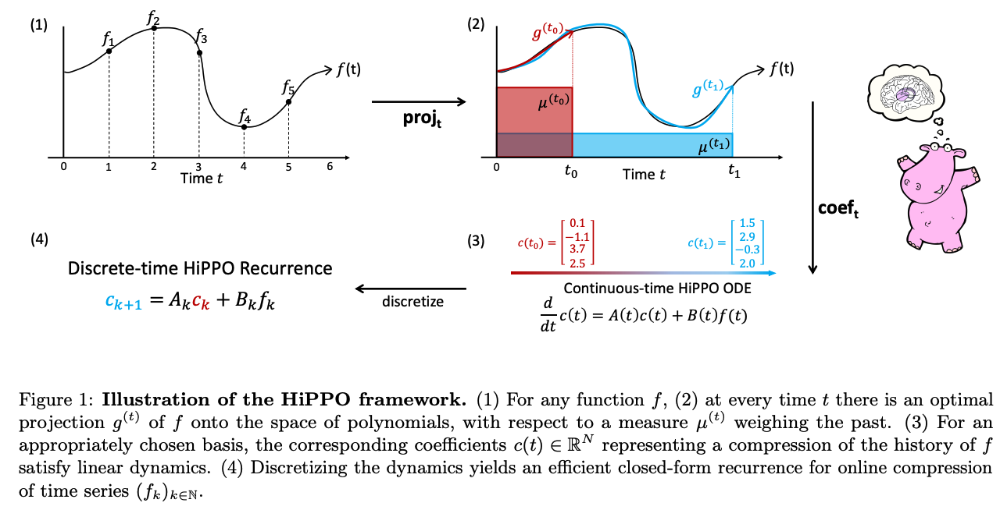
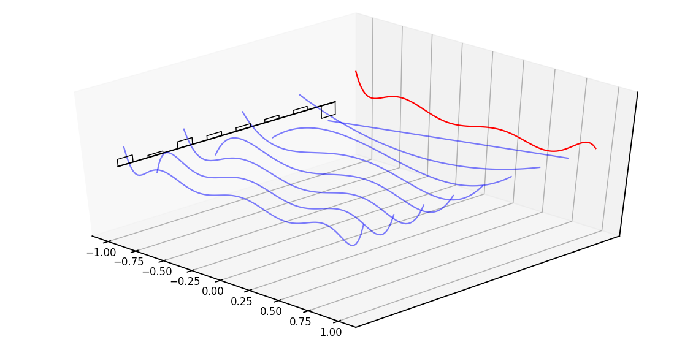
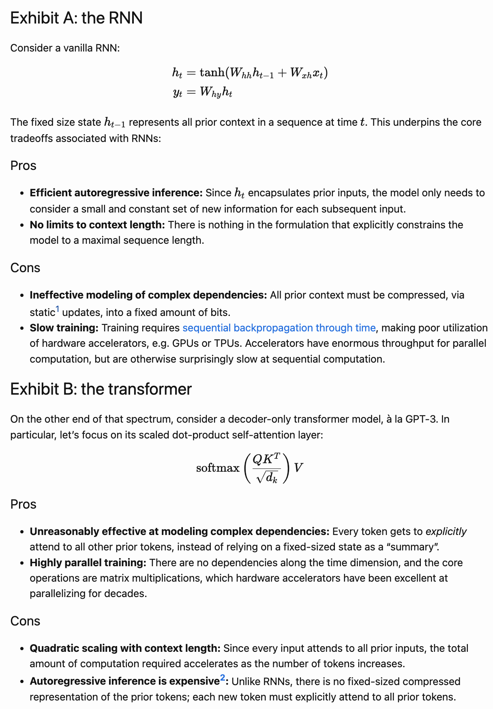
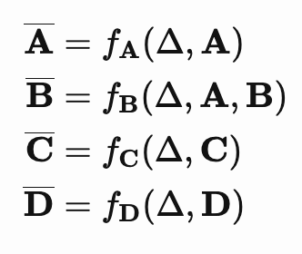
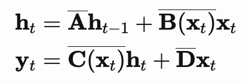

<b>Link (must read for code snippets):</b> https://srush.github.io/annotated-s4/

---

- S4 can be used as CNN during training and RNN during run time thus being the best in both worlds.
- State space model - Mapping 1D input signal `u(t)` to N-D intermediate/latent signal `x(t)` and again back to 1D output signal `y(t)`
- `A, B, C, D` are the parameters for one SSM which we learn via gradient descent. `D` is basically a skip connection so it's usually omitted.
- Inputs usually are discrete form (text, audio, pixels etc;). So, to apply SSM to these discrete inputs, we need to use step size $\Delta$ which tells the resolution of the input. Some implicit continuous signal `u` mapped to discrete signal $u_{k}$ which we observe i.e $u_{k} = u(k\Delta)$. So, to discretize the continuous form SSM, we use `bilinear method` which converts A, B, C to it's discrete versions, $A^{-}$, $B^{-}$, $C^{-}$.
- Continuous-time SSM: Function to function mapping equations. But in real time we need discrete-time SSM: Mapping sequence to sequence $u_{k}$ -> $y_{k}$
- As RNNs are not practical to train, these linear time-invariant (LTI) recurrent SSMs can be rewritten as discrete convolutions thus making them efficient to train. By unrolling the equations, we can write it as $K^{-}$, a big kernel/vector (see the blog for unrolling equation).
- HiPPO is used to initialize the log step ($\Delta$).
- Randomly initialized SSMs doesn't perform very well due to vanishing/exploding gradients problem and naive computation is very slow!
 HiPPO specifies a certain form of `A` which when used allow the state `x(t)` to memorize the history of input `u(t)` more better. This matrix is computed only once and it has a nice structure which we can exploit to make it run faster. Basically, this matrix aims to compress the past history into a state that has enough information to approximately reconstruct the history.
- This new matrix representation `A` produces a hidden state that memorizes the history by keeping track of the coefficients of a Legendre polynomial which is helpful to approximate/reconstruct the history!
 Red is the actual function, the black bars are the coefficients and blue are the functions of legendre series. During training, these coefficients will be updated in the HiPPO matrix
- In the CNN part, there's $A^k$ part where we have to do those many matrix operations which is slow! O(N^2L) operations and O(NL) memory where N is the matrix size and L is the number of successive multiplications.
- For computational speed - SSM is first thought to be formed using DPLR (Diagonal Plus Low Rank) i.e ($\Lambda$ - PQ*, B, C). Under this, the speed bottleneck is overcome by
    - Instead of computing $K^{-}$ directly, it's spectrum is computed using `truncated generating function`. This reformulates it to `inverse` rather than `power`.
    - For diagonal matrix case - It's cauchy kernel
    - Relax the diagonal assumption. The low-rank term can be corrected using `Woodbury identity`
- SSM generating functions: Switch the problem from computing the sequence to computing it's generating z-function. That's to address the computing powers of $A^{-}$.
- Now, instead of powers, we need to compute the inverse L times. Assuming it to be diagonal matrix makes a faster way to compute the inverse using cauchy kernel.
- Now, to relax this assumption of special structure i.e diagonal case, we add a low rank component `PQ*` such that $A = \Lambda - PQ*$. Now, the inverse of a diagonal + rank-1 low rank term can be easily computed using Woodbury identity which is the inverse of the diagonal plus a rank-1 term.
- This computationally fast implementation is for DPLR family, but we want HiPPO as well to capture the long range dependencies. HiPPO is NPLR (Normal Plus Low-Rank) which is `normal matrices` that are `unitarily diagonalizable`, the formulation applies to these sort of matrices as well. A unitary matrix is normal but a normal matrix might not be unitary!

---
Mamba
<b> Link: </b> https://jameschen.io/jekyll/update/2024/02/12/mamba.html. 
This is a quick and excellent read for refreshing!
- Mamba is basically S4 + Selective SSM parameters + efficient implementation via parallel scan.
 Basically, how to improve the model quality with compute constraints!?
- Mamba - based on S4 which is LTI SSM -> Linear Time Invariant State Space Model. A - State matrix, B - Input matrix, C - Output matrix, D - Feedthrough matrix.
- h`(t) depends on h(t) so basically evolving at that time i.e the current value of h determines how h is changing at that moment of time. 
- $\Delta$, the step size is also learned parameter.
 Fixed functional choices to discretize these matrices. That's done by HiPPO etc;
- For discretization, there are many methods - Euler method, Zero-order-hold (ZOH) or bilinear method. Euler is the weakest, S4 uses bilinear method while Mamba uses ZOH.
- The Structured State Space models (S4) is basically HiPPO initialization stuff for discretized version of state space models.
- S4 - B, C, $\Delta$ are all linear time invariant. Mamba: B, C and $\Delta$ are now functions of $x_{t}$ i.e the parameters are `selective`. This is to pay attention to specific inputs/outputs or forget other ones just like attention in transformers.
 LTI is important for S4 as it's efficient to implement. Now in S4, this fast and parallel implementation can be done by unrolling the equation and creating a kernel, so thus using FFT trick to multiply `K` and `u` and apply inverse FFT to get the actual values. But LTI restricts the expressivity as every update to state is handled identically i.e the current input is relevant or irrelevant is not used to update the states. With linear time variance, we can selectively chose what signal to carry forward. It's like S4 is RNN and Mamba is LSTM/GRU.
- Now, as Mamba is no longer linear time invariant - thus losing parallelization but gaining expressivity, we can't use the kernal convolution FFT trick for fast computation. Now we have better expressivity but compute is still bad in usage.
- They used `Blelloch work-efficient parallel scan` and `hardware aware memory management` to make the computations fast!! 
- A and D are LTI, B and C are parameterized by $x_{t}$ and discretized 
- Memory efficiency in terms of minimizing number of transfers from DRAM to SRAM - The size of intermediate computations are larger compared with input and output themselves in both transformer and mamba i.e O(BLDN) > O(BLD + DN). So, computations are done in a blockwise fashion, maximizing the amount of computation that can occur in SRAM before needing to load to/from HBM.
- 
