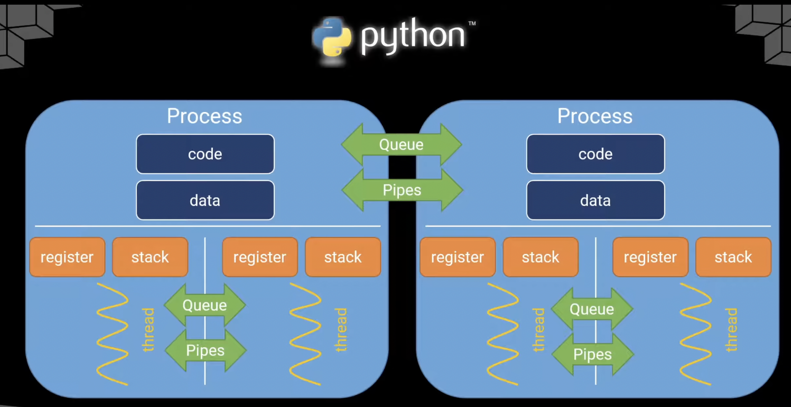
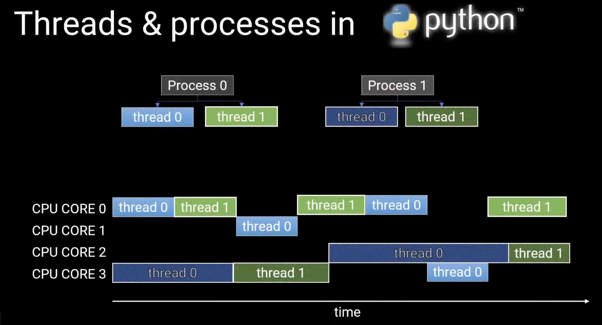
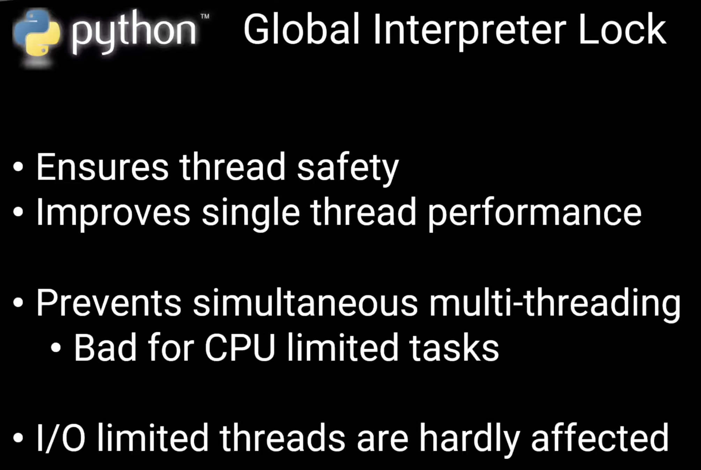
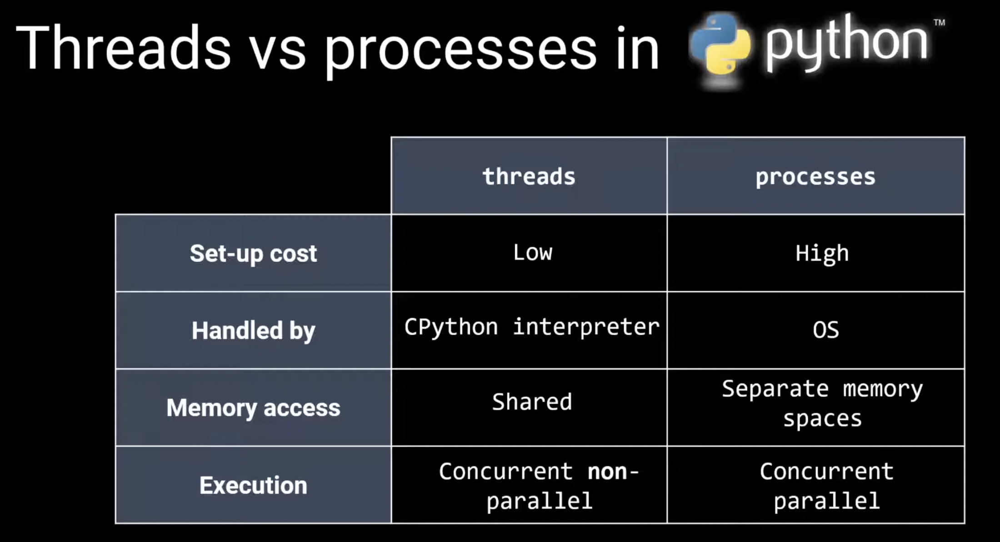
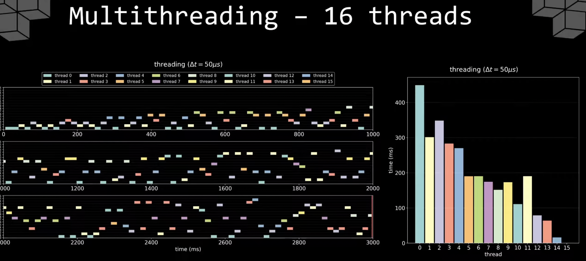
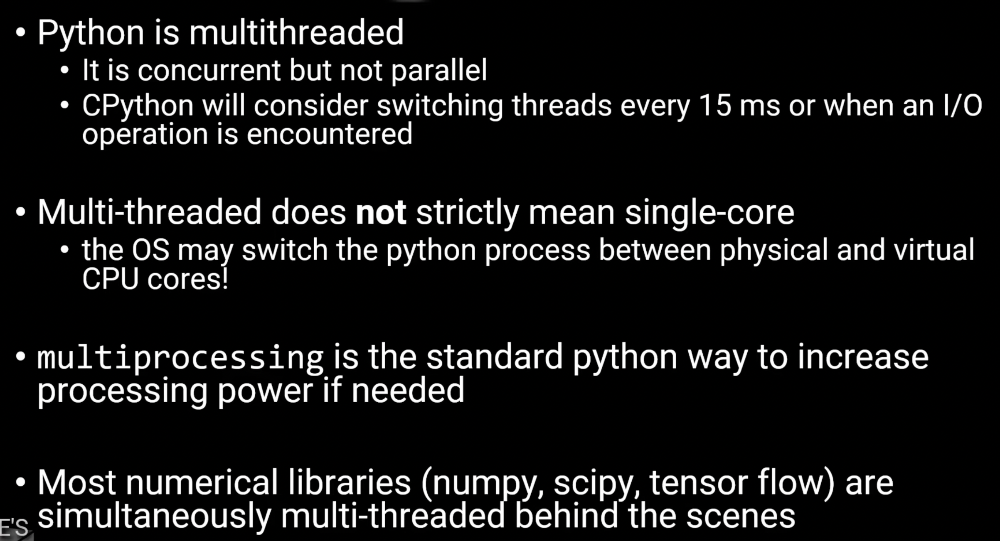
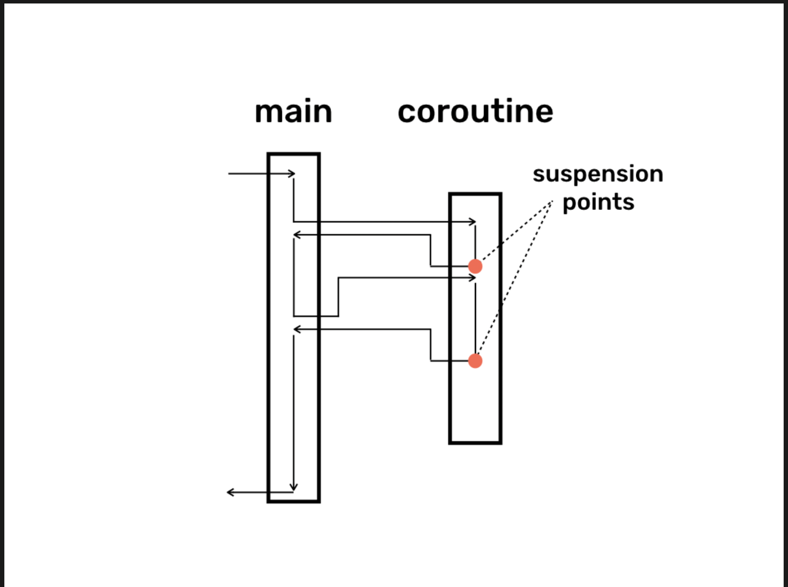

## Async/Await in Python

### TL;DR Notes

- We can use async/await only for (almost) independent function calls such as IO, processing on different files etc; If there's dependence i.e one function needs , this won't work
- **Coroutine** - It's a function which can be suspended at a given point (that point is known as `suspension point`) and which can be resumed from suspension point i.e all the local variables and arguments are present! 
    - One way: A function which has `async` keyword (mandatory; to define it's asynchronous, can be stopped at somepoint) and `await` keyword (not mandatory, but that's the point where we plan to stop) inside it
    - Coroutines can be implemented by using many ways -- `threads, yied/async/await and call/cc`
- **Event Loop** - An infinite loop which keeps checking for any async tasks which are awaiting for resources, this is like a scheduler, manager, traffic controller which keeps track of all async tasks and allocates resources to them as and when they are free. Under the hood, this is a queue which manage tasks
- Do `await` on **tasks** (create tasks on coroutines using `asyncio.create_task()` and do `await asyncio.gather()`) for best event loop efficiency. awaiting on coroutines is not ideal as it will simply step inside it
- **Example 2** - async on coroutines (read as `await coroutine`) will directly step inside the function and runs/utilizes the resources. So, if there's any sleep (real world IO) wait times inside coroutines, this will block the resources for event loop and thus works same as synchronous
- **Example 3** - If there are no `await` inside the coroutines (which is valid), even though all tasks are created and fired at once i.e async on tasks, the resources will still be throttled by one or other coroutine because we didn't say where the loop is allowed to interrupt your function to run another task while waiting on the data (IO) or result.
- TODOs: Blocking the event loop, yielding the event loop ...
---

## Example 1: Proper Async/Await Usage

Proper example of how async await works:
- `main()` is kept on event loop control by `asyncio.run()`
- All `async` tasks are first collected in a list using `create_task` -- We won't await them there itself, refer Example 2
- Once all tasks are created, await them using `asyncio.gather()` - all the tasks will be fired together
  - Note: `*list` means each element of list will be passed to the function independently i.e unpacking
- Inside the actual function, we `await` for 1 sec - replicating any IO operation etc; before printing
- **Result: ~1 sec total** (the right way to do it)

```python
import asyncio
import time

async def print_number(number):
    print("Sleeping for 1 second...")
    await asyncio.sleep(1)
    print(f"Number: {number}")


async def main():
    tasks = []
    for i in range(5):
        tasks.append(asyncio.create_task(print_number(i)))
    await asyncio.gather(*tasks)


# Put main() on event control loop
if __name__ == "__main__":
    start = time.time()
    asyncio.run(main())
    end = time.time()
    print(f"Total time: {end - start} seconds")
```

---

## Example 2: Improper Async Usage - Awaiting Coroutines Directly

Not the best usage of async and await:
- Here, we are awaiting a coroutine (async function), so it just steps into the coroutine and runs it
- Even if there's await inside the coroutine (`asyncio.sleep`), and the control goes to event loop, there's no other thing for event loop to pass and run i.e `print_number(5)` didn't get created when `print_number(1)` is running as we have awaited the coroutine, so it is basically running sequentially!
- **Result: 5 seconds** (same as synchronous)

```python
import asyncio
import time

async def print_number(number):
    print("Sleeping for 1 second...")
    await asyncio.sleep(1)
    print(f"Number: {number}")


async def main():
    for i in range(5):
        await print_number(i)


if __name__ == "__main__":
    start = time.time()
    asyncio.run(main())
    end = time.time()
    print(f"Total time: {end - start} seconds")
```

---

## Example 3: Bad Async Usage - Missing `await` Inside Coroutine

Bad example usage of async and await - Technically, **a coroutine NEED NOT HAVE an await inside it!** So, not awaiting IO blocking line will cause to run suboptimal.

- Here we are awaiting the `tasks` (which is the right way) i.e we created 5 coroutines and are firing all of them at once
- But the actual async function (`print_number`) **DOESN'T have any await inside it**, so even though all the 5 are fired at once (remember these are NOT run parallely on different resources and require common resources i.e Python is *single threaded*), when one coroutine is running (e.g., `print_number(1)`) and encounters the sleep (real world IO), as we are not awaiting, the control WON'T go back to the event loop and other coroutines won't get a chance to run on the main code thread
- **Result: 5 seconds** (still sequential due to blocking `time.sleep()`)
- Tip: If you have a 3rd party function call, await it to be on safer side.

```python
import asyncio
import time


async def print_number(number):
    print("Sleeping for 1 second...")
    time.sleep(1)  # This is not awaiting, so will literally sleep/block resource.
    print(f"Number: {number}")


async def main():
    tasks = []
    for i in range(5):
        tasks.append(asyncio.create_task(print_number(i)))
    await asyncio.gather(*tasks)


if __name__ == "__main__":
    start = time.time()
    asyncio.run(main())
    end = time.time()
    print(f"Total time: {end - start} seconds")
```

---

## Example 4: Pure Synchronous Function (Baseline)

Pure synchronous function, nothing async about it - Straightforward.
- **Result: 5 seconds**

```python
import time


def print_number(number):
    print("Sleeping for 1 second...")
    time.sleep(1)
    print(f"Number: {number}")


def main():
    for i in range(5):
        print_number(i)


if __name__ == "__main__":
    start = time.time()
    main()
    end = time.time()
    print(f"Total time: {end - start} seconds")
```

---

## Example 5: Syntax Error - `await` Without `async`

Bad example of async and await but because of **syntax**!
- You can't have an `await` without declaring the function as `async`. That will throw an error.

```python
if __name__ == "__main__":
    import asyncio

    # This will throw SyntaxError as we are trying to await without async function
    def wrong_main():
        await asyncio.sleep(1)  # SyntaxError!
        print("Hello, World!")

    asyncio.run(wrong_main())
```

---

## Example 6: Real World - CPU + IO Bound Tasks

Real world example of async (combination of above examples) where we will have both CPU and IO bound tasks.

- We can't speed up the factorial execution itself using async as it's a CPU bound (we can fast it using multithread, caching etc;), but if there are multiple factorials needed, we can run them asynchronously
- Sleep is simulating real world IO bound tasking
- If using `await asyncio.sleep(1)` → the entire code takes **~10 sec** as all the 3 factorial functions run by taking turns
- If using `time.sleep(1)` → it will take **~20 sec**

```python
import asyncio
import time


async def async_factorial(name, n):
    start_time = time.time()
    print(f"Task {name}: Starting factorial({n})")
    result = 1
    for i in range(1, n + 1):
        result *= i
        await asyncio.sleep(1)
        # Yield control back to the event loop (e.g., to run another task)
        # await asyncio.sleep(0)  # Minimal yield for demo, real I/O uses longer sleeps
    print(f"Task {name}: factorial({n}) = {result}")
    print(f"Time taken for Task {name}: {time.time() - start_time:.4f} seconds")
    return result


async def main():
    start_time = time.time()
    # Schedule multiple factorial tasks concurrently
    tasks = [
        asyncio.create_task(async_factorial("A", 10)),
        asyncio.create_task(async_factorial("B", 4)),
        asyncio.create_task(async_factorial("C", 6)),
    ]
    await asyncio.gather(*tasks)
    end_time = time.time()
    print(f"Total time: {end_time - start_time:.4f} seconds")


asyncio.run(main())
```

#### Multithreading vs multiprocessing (in Python)
- Python is multithreaded but not simultaneously multithreaded i.e 2 threads cannot simultaneously execute the same thing
- A thread is the atomic instruction an `os` can arrange to run program. Process is the instance of a program which has the code (instructions) and relevant data. And each process will have a min of 1 thread (single threaded) or multiple (multithreaded) which has it's own stack etc; Now, different processes can share data etc; using queues and different threads also can share data using queues!
- Threads for concurrency, processes for parallelism!
-  Python threads are concurrent (see how thread 0 and thread 1 in process 0 got interleaved) i.e async/await is under the hood i.e when thread 0 is busy to get data for eg, thread 1 is run on core 0. The image also shows that these are not parallel i.e no two threads from same process are not run at same time at any point!! That also means each thread of a process (thread 0 of process 0) cannot be executed simultaneously on multiple cores. But threads coming from different process can be run simultaneously (thread 0 of process 0 and thread 1 of process 1 for eg are run at same point of time)!!
- This running of only 1 thread from a process at any time on cores is ensured by *GIL (Global Interpreter lock)* i.e this is like a relay *within the process* who gives permission to only 1 thread from a process at any point of time to be on cores (running) 
-  This ensures thread safety (no deadlocks), affects *simultaneous multithreading within a process* and bad to parallelize CPU bound tasks!! but IO bound tasks are hardly affected
- 
- CPython Interpreter will make sure to handle the resource to a different thread; basically a chance to execute if the current thread has no IO request to make or if the resource time is > 15ms (very long time for programs) whichever happens sooner. To make sure things are fair for all threads in a process. But at the end, the load for all threads won't be always equal!! Now, when a thread is kicked out, there'll be some cool-off period before it is reassigned, thus that can be viewed as one source of thread loading differences
-  4 threads or 8 threads or 16 threads..CPU bound task (this example) will do same number of function calls as Python can't run simultaneous threads!! Also, the thread allocation is assymetry i.e few threads did very less work! This is multithreading which is not useful for improving the execution
- So, to improve execution for CPU bound tasks, one has to do multi processing. And `perf_counter` is relative to the start of process, but `time.time()` is the general one i.e not process specific
-  See how in multithreading only 1 thread was able to run i.e the rest of the cores are sitting free!! while in multiprocess all the cores are busy as some thread inside each process made sure to be on each of those physical cores!. 
-  Again, for CPU bounded tasks such as actual calculations/manipulations - multiprocessing is the way to go. For IO bounded tasks such as waiting for data from disk or database queries, waiting for URLs to resolve - multithreading is the way to go.
- 
- As processes don't share stuff easily (they need queues/ pipes), if one process gets corrupted, other processes still run fine. Chrome takes this `process isolation` for thier tabs 
- `ThreadPoolExecutor` does multithreading (so use for IO bound tasks) and `ProcessPoolExecutor` does multiprocessing (so use for CPU bound tasks)
- `threading` to barebones - `thread.start()` to actually assign threads and `thread.join()` make sure the thread is done before going to next line of code! Below is an example of old way
```python
import threading
import time

def do_something(sec):
    print(f"Sleeping for {sec} second(s)")
    time.sleep()
    print("Done sleeping")

start = time.perf_counter()
threads = []
for _ in range(10):
    t = threading.Thread(target=do_something, args=[2]) # sleep for 2 sec
    t.start() # start the thread
    threads.append(t)

### Without the below 2 lines, while the above code is running, the next lines of code will also run!, comment and see the time difference
for thread in threads:
    thread.join()

end = time.perf_counter()
print("Finished in {end - start} sec")
```
- Different way of doing using `ThreadPoolExecutor`, `submit` basically schedules a function and returns the future object (a contract that says this will get the value after sometime)
```python
import concurrent.futures
with concurrent.futures.ThreadPoolExecutor as executor:
    secs = [5, 4, 3, 2, 1]
    results_future_object = [executor.submit(do_something, sec) for sec in secs] # submit each one to one thread, `submit` returns a future object

    ## Whenever a result is done i.e yielded, print the result
    ## so, result will not come as we started, but as they got completed i.e whichever one completes first will come out
    for f in concurrent.futures.as_completed(results_future_object):
        print(f.result())
```
- Even easier way, using `map`
```python
import concurrent.futures
with concurrent.futures.ThreadPoolExecutor as executor:
    secs = [5, 4, 3, 2, 1]
    ## map returns the actual results
    ## map unlike `as_completed` will actually get the results as they are started. The time doesn't change compared to `submit and as_completed` but the order changes..it's like map basically waits for everything to finish before giving the actual results as map is giving iterators unlike future objects as the submit.
    results = executor.map(do_something, secs)
    # so, to handle exceptions, we need to do that in the for loop!! 
    for result in results:
        print(result)
```
- Below is an old way to do multiprocessing
```python
import multiprocessing
import time

def do_something(sec):
    print(f"Sleeping for {sec} second(s)")
    time.sleep()
    print("Done sleeping")

start = time.perf_counter()
processes = []
for _ in range(10):
    p = multiprocessing.Process(target=do_something, args=[2]) # sleep for 2 sec
    p.start() # start the process
    processes.append(p)

### Without the below 2 lines, while the above code is running, the next lines of code will also run!, comment and see the time difference
for process in processes:
    process.join()

end = time.perf_counter()
print("Finished in {end - start} sec")
```
- `join` makes sure that that process (or) thread on whichever it is called is done before the next line of code executes. If it's not there, the next lines run thus getting wrong time. If it's there inside the actual process for loop (`p.start`, immediately `p.join`), then it's basically synchronous code as not all processes has started at t=0!!
- Different way of doing using `ProcessPoolExecutor`
```python
import concurrent.futures
with concurrent.futures.ProcessPoolExecutor as executor:
    secs = [5, 4, 3, 2, 1]
    results_future_object = [executor.submit(do_something, sec) for sec in secs] # submit each one to one core, even though there might be more jobs than cores, our os will take care of it. `submit` returns a future object

    ## Whenever a result is done i.e yielded, print the result
    ## so, result will not come as we started, but as they got completed i.e whichever one completes first will come out. 
    for f in concurrent.futures.as_completed(results_future_object):
        print(f.result())
```
- Even easier way, using `map`
```python
import concurrent.futures
with concurrent.futures.ProcessPoolExecutor as executor:
    secs = [5, 4, 3, 2, 1]
    ## map returns the actual results
    ## map unlike `as_completed` will actually get the results as they are started. The time doesn't change compared to `submit and as_completed` but the order changes..it's like map basically waits for everything to finish before giving the actual results as map is giving iterators unlike future objects as the submit.
    results = executor.map(do_something, secs)
    # so, to handle exceptions, we need to do that in the for loop!! 
    for result in results:
        print(result)
```
- Multiprocessing is beneficial for IO bound tasks as well. But it's sophisticated solution (too many resources will be wastefully used) for IO bound, thus less efficient overall.
- <b>Another very good read:</b> https://emptysqua.re/blog/why-should-async-get-all-the-love/
- Asyncio and Threading are 2 ways to achieve concurrency!!  Multithreading uses `preemptive multitasking` (os interrupting tasks and allocating accordingly, threads don't decide for how long to run) while `asyncio` uses event loop and `cooperative multitasking` (os doesn't handle context switching and it's controlled by developer by properly yielding using `await` for IO intensive parts). Concurrency doesn't necessarily mean running at the same time. They just have overlap in their wait times!! (as these are usually IO bound ones)
-  For very high number of concurrent tasks, it's better to use `asyncio` as creating each thread has some memory cost.
- <b> A bit advanced blog post, need reread </b>: https://yoric.github.io/post/quite-a-few-words-about-async/
---
<b> Blogpost: </b> https://dmitrykandalov.com/coroutines-as-threads
- `yield` will give control to `main` program. The coroutine might not finish the entire execution i.e the `main` might have done
-  This shows that when the control is not given back to the coroutine, `main` will complete and some part of the code inside the coroutine won't run and they showed example.
- In the below example, because of  `while` -  that instruction and local variable is stored in stack and resumed! If you change it to `if`, only 5 will be printed.  

```python
def countdown(n):
    print("Starting countdown...")
    while n > 0:
        yield n
        n -= 1
    print("Countdown finished!")

# Using the generator
for number in countdown(5):
    print(number) 
```
- Question: In the below example, why did `Countdown finished!` got printed. Basically why did the code go to function after printing!! Is this because `main` is underneath a `coroutine` in Python? 
``` python
def countdown(n):
    print("Starting countdown...")
    yield n
    n -= 1
    print("Countdown finished!")

# Using the generator
for number in countdown(5):
    print(number)
```
- Understand difference between stackful vs stackless coroutines in detail?!!