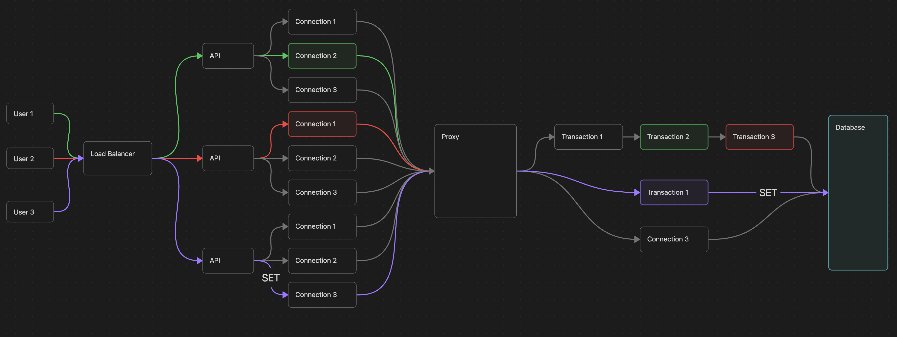

### RDS Proxy, Multiplexing and Pinning
Link: https://docs.aws.amazon.com/AmazonRDS/latest/UserGuide/rds-proxy-pinning.html
- Opening database connections are expensive, so we can have a set of connections open and ready to use, called a connection pool. This is what SQLAlchemy does at client side by `AsyncEngine`.
```
Your App (SQLAlchemy pool)
        │
        ▼
   RDS Proxy  ◄── has its own pool of connections to the DB
        │
        ▼
   RDS PostgreSQL instance
```
- RDS Proxy is server-side, AWS managed database proxy which sits between your application (client) and AWS RDS instance. Let's say our client has 100 application instances with each one having 50 pooled connections (from `AsyncEngine`), that means we have 5000 connections to the database. RDS Proxy manages these 5000 connections to let's say 50 connections to actual RDS instance.
- Now, RDS proxy manages these 50 connections which ideally can be shared across multiple application instances which is known as `multiplexing`. In below eg, we can see that transaction 1 and transaction 2 are using the same connection #7, but transaction 3 is using a different connection #3. This is because RDS Proxy can reuse connections for different transactions, but it can also choose to use a different connection if it thinks it's more efficient.
- The unit of multiplexing is the transaction, not the request i.e if a request has multiple transactions, they can be multiplexed across different connections in the pool. While request A is **between** transactions (waiting for the next HTTP call from the user or doing some non-DB work like embedding) — its connection goes back to the pool and RDS Proxy hands it to other requests. When Request A starts a new transaction, it can possibly get a different connection. The connection is only used for the duration of a transaction, and then it goes back to the pool for other transactions to use. Think of it like `async handing control over event loop to other tasks while waiting for I/O` ( in Python code for eg.) but at the database connection level i.e concurrently handling multiple transactions across different connections in the pool, instead of handling one transaction at a time on a single connection.
```
Time →

Request A: |--txn 1--|[embed query → Azure OpenAI ~300ms]|--txn 2--|  [LLM streams response ~2-5s]  |--txn 3--|
Request B: [embed query → Azure OpenAI ~300ms]  |--txn 1--|  [LLM streams response ~2-5s]  |--txn 2--|

DB conn #7: [==A txn1==][==B txn1==]                                               [==A txn3==]
DB conn #3:                    [==A txn2==]                                 [==B txn2==]

```
```
Transaction 1: App session A uses DB connection #7  → transaction ends, #7 freed
Transaction 2: App session B uses DB connection #7  → proxy reuses freed #7
Transaction 3: App session A uses DB connection #3  → #7 was taken, gets #3 instead
Transaction 4: App session B uses DB connection #3  → A's txn 2 ended, #3 freed, B reuses it
Transaction 5: App session A uses DB connection #7  → B's txn 2 is using #3, #7 is free, A reuses it
```
- **Pinning** is when this multiplexing doesn't work anymore. If session A changes some **session-level state** on connection #7 — e.g. a `SET` variable — then connection #7 is now "dirty" i.e RDS Proxy can't safely hand it to session B, because session B would inherit session A's state unexpectedly. So RDS Proxy **pins** session A to connection #7 for the rest of the session. The connection can't be multiplexed anymore. If all your sessions pin, you've lost the benefit of the proxy entirely.

 Each color represents how the information is flowed. If there's `SET` command, the connection is pinned and can't be multiplexed anymore. If there's no `SET` command, the connection can be multiplexed (used by other requests) freely.
- So, avoid having session-level changes in application code. 
  - This is a specific example from our work chatbot application - if you need to set semantic search `hnsw` scan to `relaxed_order`, instead of doing it at runtime with `SET LOCAL hnsw.iterative_scan = 'relaxed_order'`, you can set it at the database level with `'ALTER DATABASE mydb SET hnsw.iterative_scan = ''relaxed_order'''`. This way, the setting is applied when Postgres creates each connection, and RDS Proxy doesn't see any `SET` commands that would trigger pinning allowing for multiplexing with `relaxed_order` setting.

| | Old approach | New approach |
|---|---|---|
| **Where setting lives** | Per-query `SET LOCAL` at runtime | `ALTER DATABASE` at migration time |
| **When it's applied** | Every transaction, inside your app | Once, when Postgres creates each connection |
| **RDS Proxy sees** | A `SET` command → triggers pinning | Nothing — setting is already in place |
| **Multiplexing** | Broken — every session pins | Works freely |
| **`relaxed_order` active?** | Yes, but at high cost | Yes, for free |
