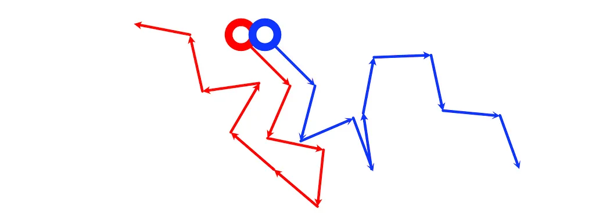
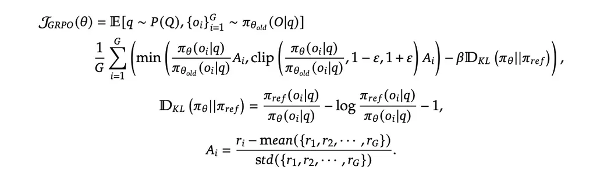
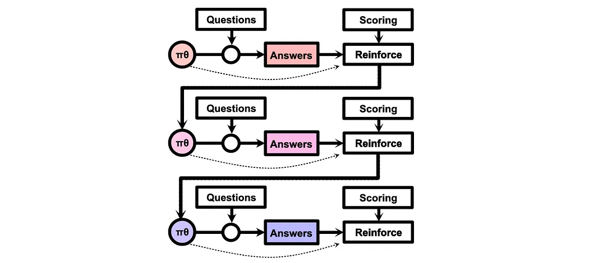
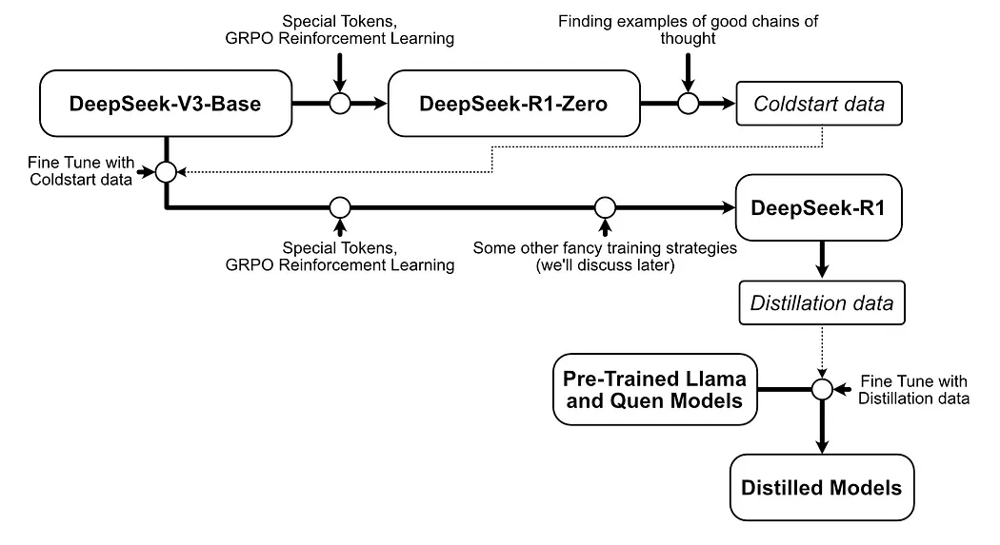

<b> Blog: </b> https://iaee.substack.com/p/deepseek-r1-intuitively-and-exhaustively

---
- DeepSeek-V3-Base: Just like any other LLM, unsupervised learning, 671B model
- DeepSeek R1-Zero: Did RL on top of V3, but this resulted in inconsistencies in model outputs, switching languages etc;

So,they instead collected high quality examples from R1-Zero by inspecting the thoughts and asking it to think more carefully.
 Depending on model initialization, RL can bring to different models after training!

- DeepSeek R1: V3 first finetuned with high quality data to change the initialization point before RL. Once a new model initialization is achieved, then RL is done with more examples.
- Once R1 is created, they generated 800k high quality questions and finetuned smaller models of LLama and Qwen to impart it's knowledge on these models.
- So, V3 -> do RL to get R1-Zero (even though it's unstable, collect high quality examples from this) -> Finetune V3 -> new initialized model, RL on this model for a more stable R1 -> generate high-quality dataset and distill the knowledge on smaller models of Llama and Qwen 

Some issues of RL and what motivated GRPO
- Deviation from Goodness: Going down the rabbit hole. Thinking it's trying to solve the problem in the right way but all it's doing is circling around!
- Inefficiency in performance estimation - Just because we are sacrificing/making a bad move now doesn't mean that we will lose. The algorithm needs to have a futuristic view!

 The higher the objective function, the better the model is getting trained!
- `pi_theta` means the model we are training right now; the most recent set of parameters as part of our finetuning and `pi_theta{old}` is a specific version of the model which was from the previous round of GRPO, this model generates `o_{i}`; used to do the most recent round of testing on the data and `pi_{ref}` is the model before we do any of the GRPO i.e it's the starting model before which any of this steps happen.
-  GRPO is an iterative process, we start with a model, get the answers, reinforce the good/bad answers based on an objective thus getting a better model. Once we get the better model, we start with that model, again get the answers for a set of questions and reinforce the good/bad outputs. We do this until there's no significant improvement on the reinforced model!
- Given a query `q`, we give it to `pi_theta{old}` to generate `G` outputs. So, basically o_{i} is the i-th output for the same query `q` and same model `G`. 

<b>Question:</b> Sampling G times != Asking the model to give G answers (think why in terms of probability)
- Once we have `o_{i}`s, pass it to the reward function to get `r_{i}` basically converting the output string space to numerical space by a function. The function tells how good the string is by comparing to output and some heuristics/checkboxes (if the output satisfied criteria X, Y, Z etc;).
- From the rewards, `r_{i}` we compute the Advantage which is basically the bell-curve versioning of the rewards i.e sort of normalizing.
- So, the Advantage of the ith output will be the reward of the i-th output minus the mean of all the rewards divided by the standard deviation of all the rewards. That's the "Group Relative" part of the GRPO.
- `pi_{theta}`/`pi_theta{old}` basically tells for a given question, how the probability of the answer is changing as the model is training. So, if the old and new models are similar, the ratio is high so we can use this example strongly. If the probability of old model is much higher, then this ratio goes to 0 which means this example is deviating the model a lot so don't use it for training. 
 The old and new models might have slightly different outputs. For instance, the old model might output the answer directly, while πθ may begin outputting words like "well" in the beginning of the output. GRPO would use the ratio of the likelihood of "Paris" from the old and new model to approximate how similar or different the models are.
- The core concept of reinforcement learning is to learn via examples but not deviate a lot by constraining!!! This shows the `clip` part of the equation.

- Think about the possible scenarios
  * Advantage is high and old model is more confident
    * It's a good answer but the signal is not coming to new model so it's not de-incentivized or heavily reinforced due to `clip`
  * Advantage is high and new model is more confident
    * It's a good answer and the signal is coming to new model training, so the model training will be reinforced.
  * Advantage is low/negative and old model is more confident
    * It's not a good answer, signal is not coming to new model so nothing major happens due to `clip`
  * Advantage is low/negative and new model is more confident
    * It's not a good answer and signal comes to the new model training so the training will be de-incentivized with this example

Example explanation for some
- If an answer is good and the model is confident, `pi_theta` will be higher than `pi_theta_{old}` which will amplify the advantage `A_{i}` for that particular response. But this amplification shouldn't go off the roof, so the 2nd part of equation has the `clip` which will take care to limit it using `\epsilon` i.e we allow the model to explore in limited range!!
- In similar way, if the advantage is negative and the new model is more confident than the old model, we should avoid going to that direction!! So the model will de-incentivize bad outputs as the objective function returns a -ve number from first part rather than the `clip` due to `min`.
- Once our new model is sufficiently different from old model, we might have to expose the new model to our questions again and thus this will become our old model and we need to do RL again! This is sample-wise efficient.

- KL-Divergence term is the standard distance between 2 probability distributions. If there's a large KL, that will negatively impact the overall objective. We want our KL-divergence of our trained model to be as close as the actual reference model before any GRPO. Basically GRPO constraints not to be too far from `pi_theta{old}` and KL-Divergence constraints not to be too far from `pi_ref`.
 KL Divergence and GRPO are in a sense very similar to constrain the trained model to be in the range of `pi_theta{old}` and `pi_ref`. So, we can imagine the model exploration space like this with yellow one being more flexible (KL Divergence) 

- Deepseek-base-v3 is basically internet scaled unsupervised nex-token finetuned decoder only model.
- Add special tokens `<think> </think>, <answer> </answer>` and did GRPO on math, science, programming data to get R1-Zero which can reason but at lot of instances is unstable in it's thought process and talks gibberish.
- As RL depends a lot on initial model point, they extracted high-quality data from R1-Zero (which is the cold-start data) and unsupervised finetuned the V3-Base to reach a new checkpoint. On top of this, they finetuned using similar techniques (and some other fancier stuff) to reach to R1.
- They distilled 800k high quality examples from R1 and finetuned Llama etc; smaller models which were better compared to their non-finetuned counterparts
- **Credit Assignment problem** - In RL, how to tell whether an output is good? Pick the examples which are easier to verify programatically so it'll be easier to scale!!
- They also splitted their reward function to 2 sub-rewards - One for correctness of answer and other for reasoning structure around the answer.
- They also have language consistency reward - If the model responds in similar language as the question, they gave small reward..this reduced the performance a little bit but this was more aligned to humans.
 The entire training pipeline of Deepseek R1
- One additional step they did is "Rejection Sampling". We use RL trained model to get high-quality, large scale, logical traces that can be further used to train the model even further to improve the generalization capabilities!! Once they get this data (800k) samples, they finetune the model again using GRPO but this time to align with human preferences
-  Small models distilled from larger models are MORE performant compared to small models training using similar pipeline of GRPO etc; The reasoning might be because large models might gain generalization capabilities which the small models will benefit from while on the other hand if we only train small models, they might not reach the capabilities in given training time! Basically to learn things, we need extra room. But once the things are learned, those parameters are less important thus can their knowledge can be distilled to smaller models. 
- Distilling from larger models to smaller models >> training smaller models from scratch!
- Thinking more -> Lot of cost for inference!! Scaling the thinking capabilities demands for more efficient inference strategies! 

