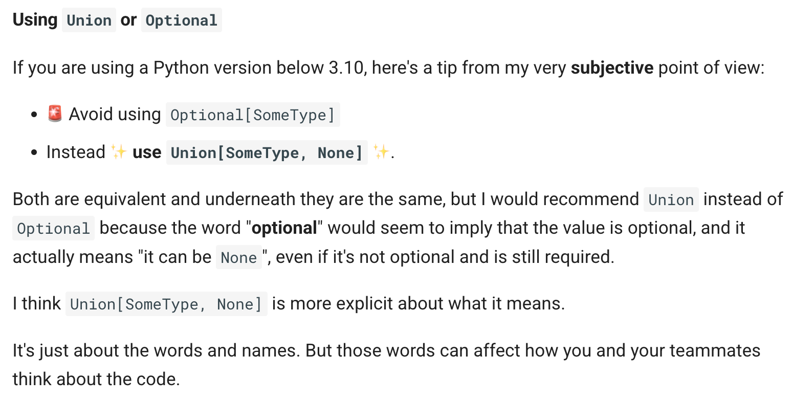

<b>Link: </b> https://fastapi.tiangolo.com/learn/
---

### Type intros


- `Optional[T]` in Python means either a T, or None. Despite the name, it does not mean a value is "optional" in the sense that you don't have to provide it, e.g. as an argument: it means the data backing the variable is optionally there - it may be there, or it may be None.

---
### Concurrency, Async and await
- Concurrency is same as "asynchronous" part of code which "synchronous" is same as "sequential" code. Concurrency is achieved by using "async and await" keywords for the function and definition that has those features. 
    - If a function x (usually 3rd party libraries) supports asynchronously, then we can do `async def func(): result = await x()`
    - If a function x doesn't support asynchronously (i.e communicating with DB etc is not supported asynchronously;), then `def func(): result = x()`
    - If your application `func` doesn't have to communicate with anything else and wait for it to respond, we can use `async def func(): result = x()` i.e we can use `async` without `await`
    - If we don't know what to do, just write normal function: `def func(): result = x()`
- Concurrency is like "ordering burger, waiting for ur turn and in the meantime doing something else i.e you won't get burger the moment you order and there's no reason to wait in queue as you have ur dedicated token". Parallelism is like "waiting in queue in a bank which has 10 cashiers to get ur work done then-and-there itself i.e there's waiting to get to cashier but there's no token and wait to get the cash stuff!!" or "getting house cleaned by multiple people (cores/SMs)"   
- Concurrency vs Parallelism:
    - Concurrency is good for scenarios which requires lots of waiting (waiting for food in counter, prepping for side dish while the main dish is getting cooked). 
        - Good for I/O bound operations (disk reading/writing, network communication and data transfer) - Operations involved in web applications.
    - Parallelism is good for scenarios where there's not much waiting but there's lots of doing (cleaning a big house by using N number of workers)
        - Good for CPU bound operations - Operations involved in Machine learning.
- When Python sees an `await`, it knows that it can go and do another task (like getting a request, usually I/O bound tasks which are not dependent on this one) while the function that has been `awaited` will complete it's execution. So, the code might look "sequential" but we do *awaiting* at right times.
- When `await` is present inside `async def` and that's the only way to do, Python will keep an eye on this line and pauses the execution of that `async def ` function there while going and finishing another function before coming back and completing this async function. It checks every now and then and runs other parts of code.
- Async def function has an await inside it and every async def function has to be called using await (await x()), so the first one that gets to be called in this cycle will be determined using path operations (@app.get(/) etc;)
- Coroutine is basically the thing that is returned by `async def` function. Python knows that it's a function that it can start and end but also will be aware that it can pause this function when it encounters an `await` inside it.
Read this indepth technical details after some background - https://fastapi.tiangolo.com/async/#very-technical-details
---
### Environment variables and Virtual environments
- Variables that live outside the code which can be used by multiple codebases and usually is operation system accessible.
- Inplace env variable setting `MY_NAME="Wade Wilson" python main.py`, this will be used only for that code execution and after that won't be accessible. Just like `CUDA_VISIBLE_DEVICES=0,1`
- Env variables can only be strings as they are super generic. So, convert to things u need inside code.
- `PATH` is a special environment variable that is used by OS to find programs to run. It's a long list separated by `:` where each path is searched for the program we want to run and if found will be used. If not, it will search in the next path. So, when we type `python` in terminal, it might be actually `/usr/local/bin/python`
- Virtual environment is a directory with some files in it which manages all the installations required for that project.
- `python -m venv .venv` -> Calling a module `venv` which comes preinstalled with Python as a script (`-m`, calling a module as script) and create the env in directory `.venv`
- `source .venv/bin/activate` to activate the virtual env in terminal CLI and check using `which python`
- Before activating a virtual environment, `PATH` might be `/usr/bin:/bin:/usr/sbin:/sbin` i.e the path will look at those 4 directories to run the program. Once we activate the virtual environment using `source .venv/bin/activate`, the `PATH` will be changed to `/home/user/code/awesome-project/.venv/bin:/usr/bin:/bin:/usr/sbin:/sbin` i.e the program will first look at our env to run the program by adding that path to the *first*. 
- Locking (`uv.lock`) is resolving the project dependencies in `pyproject.toml` to a precise list of package versions and sources that can be reliably used in production. Syncing is using this lock file to update and install the packages in the project environment. 
---
### User Guide - Basic tutorial
- OpenAPI Schema is the JSON format and the description of what the API endpoints are about, how the data interacts and is usually machine readable. OpenAPI specification is basically understanding various services without not examining the source code etc; Its like having a signature for the services.
- **Path operation decorator** -- Using decorators to specify path operations for FASTAPI: `@app.get('xyz')` - Here xyz is known as "Path" or endpoint or route. `get` is the HTTP operator and the function below that decorator is supposed to act in `get` way i.e reads/fetches data. The function below the path operator decorator is know as **Path operator function** 
- `Operations` are basic HTTP methods i.e `PUT` (to update data), `GET` (to read data), `POST` (to create data) and `DELETE` (to delete data). Others are used rare - `TRACE, OPTIONS, HEAD, PATCH` etc;
- **Path parameters:** `@app.get('item/{item_id}')`, if we have something like this, whatever we assign to item_id can be used in the path operation function. The default way it gets passed is string, but data can be converted to int etc; inside function using Python function annotations (eg: `async def x(item_id: int)`) and then it will be used as int. This conversion using annotations can be known as *serialization, parsing or marshalling*.
- Data will be automatically validated i.e in previous eg if we sent string or float, it throws an error which comes in handy for debugging. And this validation is done using Pydantic under the hood.
- *Order matters* while working with path operators i.e "users/me" and then "users/{user_id}" is valid and both will be registerd and work as expected but the other way doesn't work as expected as "users/me" feels like me is a parameters for user_ud which was already registered. 
- The first path operation function will be used incase there are many functions associated with same path operator decorator.
- General tip: Use `Enums` for predefined variables (which can be used for path parameters if needed, but make sure the type annotation is set to enum class name i.e `async def x(model_name: ModelName)`) where `class ModelName(str, Enum)` is defined.
- Path parameter can have path inside it but it's usually difficult to test and is not standard. But one can do `@app.get("/files/{file_path:path}")` which says the `file_path` we receive will be a path. That way, when a path is passed (eg: srinath/text.txt), it will look like `/files//srinath/text.txt` (look at //)
- **Query parameters:** Any other parameters that are passed to function that are not part of `path parameters` are automatically query parameters. For eg: `@app.get('/items/') async def x(a: int = 0, b: int = 0)`, here a and b are query parameters. In this case, we need to give these as `http://127.0.0.1:8000/items/?a=10&b=10`. These are by default string and will be converted and validated according to function annotations.
- Query parameters are optional, so their default values will be used if nothing is provided in the URL. So, `http://127.0.0.1:8000/items/?b=10` means `http://127.0.0.1:8000/items/?a=0&b=10` as that's default for a. These query parameters can be made optional parameters by giving their default value as `None`.
- Query parameters can be of type `bool` i.e `async def x(a: bool = False)` and now `http://127.0.0.1:8000/items/` -> this means a is False, `http://127.0.0.1:8000/items/?a=10` or `http://127.0.0.1:8000/items/?a=Yes` or anyother thing will be perceived as True inside the code. 
- ```@app.get("items/{a}") async def x(a: int, b: str, c: int = 0, d: int | None = None)``` Here a is path parameter and is required, b is query parameter and is required, c is query parameter which has a default of 0 (so it may/may not be passed) and d is a query parameter which is optional i.e if not provided it will be None.
- **Request body:** Data sent by client (via a browser for eg) to our API. `Response body` is the data the API sends to the client. Response body is almost always present but request body might not be present i.e client can just request a path with some query parameters. 
- To send data, use `POST` (common one) or `PUT`, `DELETE` or `PATCH`. Sending body using `GET` is hugely discouraged!! And to do that, create a class i.e pydantic data model (using `BaseModel`) and declare that as parameter's type annotation (eg: `async def x(a: Item)`) where `class Item(BaseModel): xxx` is declared with all the variables we pass.
- We can have all the 3 - request body, path parameters and query parameters. Eg: `@app.get("items/{c}") async def x(a: int, b: Item, c: str)`
- **Query parameters and string validations:** `async def x(a: str | None = None)` -> Here `a` can be either a string or a Nonetype and the default is set to None (because it's set to None, it's not a mandatory parameter) i.e because the default value is set, it's an optional parameter. The type annotation just helps for better support and doesn't determine whether it's mandatory/optional. i.e Having a default value of any type, including None, makes the parameter optional (not required).
- `Annotated` type annotation is used to give additional details for a parameter. And to give additional details, we can use `Query`, `Path`, `Body`, `Cookies` methods depending on what type of parameter we are dealing with. There are advantages of using Annotated wrapped around the actual methods - https://fastapi.tiangolo.com/tutorial/query-params-str-validations/#advantages-of-annotated. And each of those methods has multiple arguments for common use cases i.e to have a min_length for a query parameter, we can use `q: Annotated[str | None, Query(min_length=3)]`.
-  It's recommended to have Query inside the Annotated and if so, Query doesn't use the default and it has to be set outside -> `q: Annotated[str, Query()] = "rick"` is valid but `q: Annotated[str, Query(default = "rick")] = "morty"` is not valid.
- `q: str` -> Required, can be only of type string i.e can't be None. `q: str | None` -> Required, can be either a string or a None. But still they have to pass the None i.e will throw an error when not passed. `q: str | None = None` -> Not required, can be either a type string or None, and if not provided will be defaulted to None. 
- `async def read_items(q: Annotated[list[str], Query()] = ["foo", "bar"])` -> It is possible to have a query parameter accept as a list of values with default values. If not, now we can use it as `http://localhost:8000/items/?q=hello&q=world`. To declare a query parameter with a type of `list`, you need to explicitly use `Query`, otherwise it would be interpreted as a request body rather than query parameter.
- If a parameter is required (i.e it has to be passed), don't give a default value. Even if it can accept None, that's fine. `q : Annotated[str | None]` says that the parameter has to be passed by the user even if it's None (the annotation just says that it can accept None, not defaulting to None)
- After validators - Do the specific validation after Pydantic's internal validation i.e `@field_validator(mode='after')`. This is type safe as the raw/arbitrary inputs are first dealt with Pydantic and are considered better in practice compared with before validators.
- `async def read_items(id: Annotated[str | None, AfterValidator(check_valid_id)] = None,):` So, this id will be first validated to be either a type string or None and after that it will be validated via the function `check_valid_id` which we implement. But if we want to use some external components like a DB for this external validation, we need to use FastAPI dependencies (later tutorial).
- *Alias parameters* - We can give aliases to parameters incase we can't pass something for some reason i.e we can't pass `item-query` as Python doesn't allow that variable name.
- *Deprecated parameters* - In development, we might sometimes not use that parameter anymore (but our clients might still use it). So, for them to know, use `deprecated=True` in Query or other methods so they can know from OpenAPI specs docs. And to exclude a parameter from the OpenAPI schema, use `include_in_schema` bool argument
- **Path Parameters and Numeric Validations:** For path parameters, we can use `Path` method just like for query parameters we use `Query`. A path parameter is always required as that's part of the path. 
- Can use `gt, ge, lt, le` for number validations easily i.e `async def func(id: Annotated[int, Path(gt=1, le=100)])` says that id is a Path parameter (should be given in path when calling i.e `@app.get(items/{id}`) which has to be > 1 and <= 100
- If we have lots of query parameters, we can declare a Pydantic model and just use that i.e `async def func(query: Annotated[QueryParams, Query()])` where `class QueryParams(BaseModel): a: int, b: str` can be doable.
- `async def update_item(item_id: int, item: Item, user: User, importance: Annotated[int, Body()]):` This is fine, where `item_id` is path parameter, item, user and importance are body parameters which we will expect in the Body of the request payload. And item and user are Pydantic models which determine how those key-values should look like.
- Incase there's only one body parameter and we want that to be coming along with they key, use `embed` in `Body` - https://fastapi.tiangolo.com/tutorial/body-multiple-params/#embed-a-single-body-parameter
- For path operation function parameters, we can use `Query, Path, Body` methods for additional validation and metadata passing. Same way, for Pydantic model parameters, we can use `Field`.
- `TODO: Understand the nuances between Field and Annotator`
- We can have nested models i.e a parameter in our path operation function can accept a body parameter (Pydantic class) and one example in that class can be another Pydantic class - https://fastapi.tiangolo.com/tutorial/body-nested-models/#use-the-submodel-as-a-type
- We can show an example for any parameter in OpenAPI schema very easily using `examples` argument - https://fastapi.tiangolo.com/tutorial/schema-extra-example/#example-in-the-docs-ui
- Additional data types we can use (Like HttpUrl, datetime, UUID etc;) - https://fastapi.tiangolo.com/tutorial/extra-data-types/
- One can use `Cookie` just like `Query`, `Body`, `Path`. To declare cookies, you need to use Cookie, because otherwise the parameters would be interpreted as query parameters.