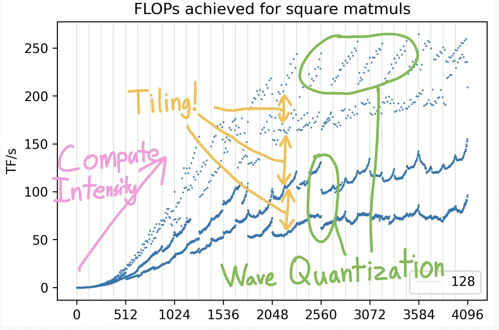
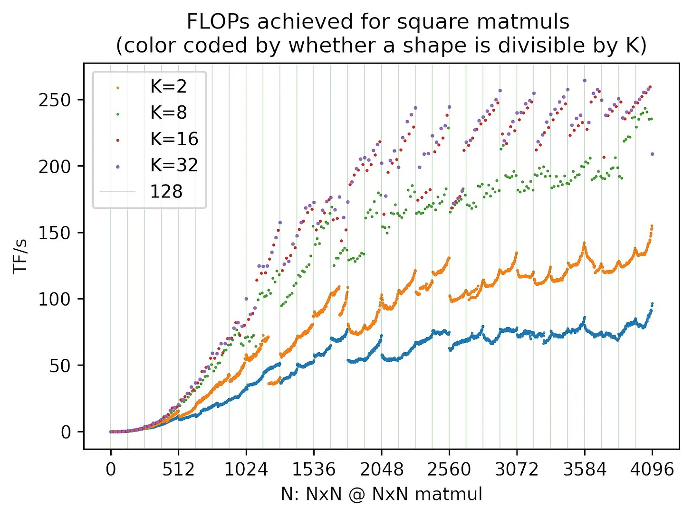
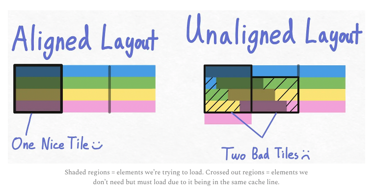
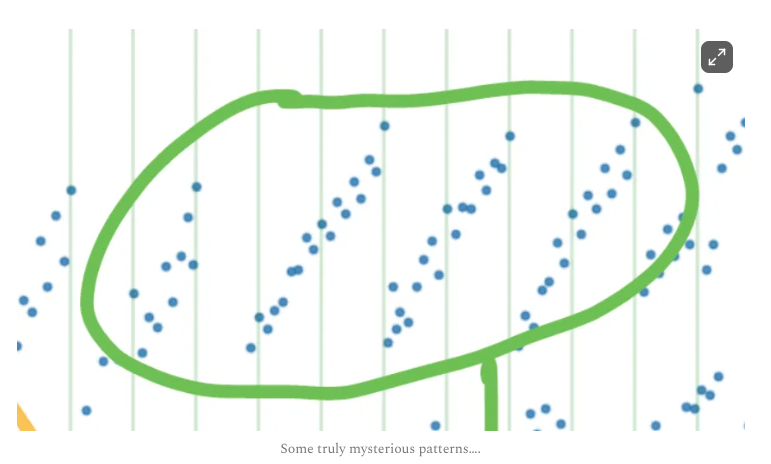
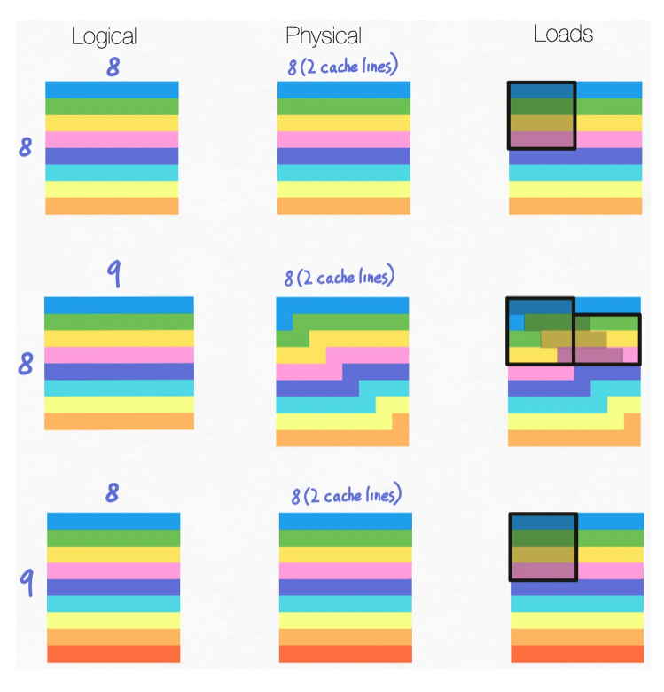

<b>Blog Link: </b> https://horace.io/brrr_intro.html

### Key notes

There are 3 components to understand GPU efficiency
1. Compute - Time spent in making the computations, calculations or FLOPS (floating point operations)
2. Memory - Time spent transferring tensors within a GPU
3. Overhead - Everything else

If we know what regime we are in, we can optimize accordingly just like ML training i.e if we are in "overfitting", increasing model size won't help and in the same way if our training loss and validation loss are very similar and high, regularization won't help.

- Memory-bandwidth bound - Most of the time is spent in transferring the tensors
- Compute-bound - Most of the time is spent in making computations or FLOPs

If we are in memory-bound, increasing GPU FLOP capacity won't help. The same way, if we are in compute-bound, increasing the efficiency of kernel in transferring tensors won't help.

#### Compute
Reducing time in memory transfers is achievable in modern hardware as technology advances but for compute reduction, we need to change the way the operations are done in our code!

Compute is like factory. It gets instructions (overhead) and materials (memory) and it has to run efficiently (compute)

So, if the factory can run even more efficiently (increasing compute, increasing FLOPS), it can utilize that only if it receives the materials faster (memory bandwidth bound).

Also, matrix multiplication specific chips (Tensor cores) can't do anything other than multiplications. So, according to NVIDIA specification he attached, matrix multiplications should be 312TFLOPs and non-matrix operations should be something like 19.2TFLOPs i.e 15x slower.

Even if it's 15x slower, it's ok because the number of non-matrix multiplications are very small (0.2%) compared to matrix multiplications in a transformer. But the actual flops that have been reported is 250x less flops (0.17 operations took 25.5 runtime, if it's same kernel then 99.8 operations will take (99.8*25.5)/0.17 ~ 14970 runtime...but because it's optimized tensorcore as it took only 61 runtime..there's a slowdown of 14970/61 ~250)and 700x less flops compared with matmul. 

Now, the non-matmul operations take so much time despite being only 0.2% in the entire transformer is because of how long it takes for these to move from one place to another in GPU i.e the memory bandwidth.

### Bandwidth

Moving the data  ...

- Data transfer cost - From CPU to GPU
- Network cost - From one node to another node
- Memory bandwidth cost or bandwidth cost - from CUDA global memory to CUDA shared memory

Factory is where things are made (Compute, SRAM) and that's optimized to be fast and storing here is expensive as the space is limited. On the other hand, things are stored in a warehouse (DRAM) as it's cheaper to store there and it's optimized for that purpose. So, when we need, we need to move things from warehouse to factory i.e DRAM to SRAM, process it in factory (compute) and transfer back. These transfers correspond to memory bandwidth.

`nvidia-smi` will show the GPU DRAM i.e the GPU storage unit. CUDA OOM is mainly responsible if we hit limit here. <b>Everytime we perform a GPU kernel, we need to move our data from and back to our GPUs DRAM.</b> And this shipping is more expensive as in will take a lot of time and the time we spend on actual computation is far less!! Since we are spending more time in transferring data rather than computation, those kind of operations are known as <b>memory-bound operation</b> for eg applying cosine, activations, normalization etc;

So, the intuition is to bring the data to the factory (SRAM, compute), perform as many operations as possible in a kernel at one stretch and then send it back to the warehouse (DRAM, memory) so you can save the number of to-and-fro trips. This is known as `operator fusion` (merging multiple operations to a single kernel).

So, ```x1 = x.cos() and x2 = x1.cos()``` will perform 4 global reads and writes i.e global read x, perform operation, global write to x1, global read x1, perform operation and global write to x2.

Instead, if we do ```x2 = x.cos().cos()```, this will be much faster as there will be only 2 global reads and writes i.e global read x, perform cosine and do a local write and perform cosine on top of that and write globally to x2.

Caveats - GPUs need to know what operation they need to run next when performing the current operation. So, doing this in eager mode where the compiler only runs one operator at a time won't work. Also, the code needs to be converted to CUDA which will bring new issues. And not all operator fusions are as easy as this pointwise operation.

##### There's a clear math example in the blog that can give some understanding on when we are considered to be memory bound and when we might be considered to be in compute bound.

Memory bandwidth - 400 billion numbers can be transferred in 1 second (1.5 terabytes/second, 32bits means 4 bytes..so 1.5/4 ~400 billion numbers)
Compute - 19.5 teraflops/sec which means ~20 trillion operations.

So, if we simply do 1 operation, we are clearly memory bound because while our system can do 20 trillion operations in a second, we are using <10% of it. Roughly around 50 operations can be done efficiently if not we will be spending more time in transferring the data rather than the computation!!

We perform 2 * N memory access (one for read and one for write) per second and N * repeat computations per second (We do a unary operation those many times). So, the memory bandwidth is `2 *N * number_of_iterations_per_second *bytes` and compute bandwidth/flops is `N* repeats* number_of_iterations_per_second`.

When repeat is very low, we are compute idle i.e memory bound as our compute is sitting idle waiting for the numbers to be shipped. Once the repeat is increased, we will reach compute bound i.e the peak FLOPs we can achieve with our system and can only be improved if we increase the systems.

In those lines, initially, as we are spending more time in transferring..our memory runtime is very high but as we increase the repeats..we are performing more computations which eventually will reduce the memory bandwidth (accessing memory i.e the time we spend in transferring) as we do more computations.

It's usually good to be in compute bound i.e roughly 80% of our peak FLOPs because we bought the GPUs to do the compute. Memory bound is something that happens naturally if we don't optimize our code in transferring the variables memory.

### Overhead
This is the time that's spent in not transferring tensors (memory) or doing multiplications (compute). The time for launching kernels, time for interpreter etc; But because there are 1000s of operations, if Pytorch can figure out to list the next operations in advance, then this slow overhead is easily compensated (it's like queueing the next steps while at current run). 

`Overhead bound` refers to GPU being idle (small operations on GPU i.e multiplications) compared to CPU (which makes the decisions for next steps). So, make sure that the GPU operators are big enough. If you increase the batch size twice but the runtime increased only 10%, then it means we are overhead bound as we are not using the GPU to do compute. This overhead is because most of the time is spent on "what to do".

For eg, if we do `a + b`, Pytorch has to know to call/dispatcher `__add__`, needs to understand what's the dtype, device etc and actually launch the kernel to perform this addition. If we spend most of our time on this, is the overhead bound. 

So, in summary
- Overhead bound - Use JIT (Just in time) compilers that can reduce the overhead (tradeoff with losing flexibility), Operator fusion
- Memory bound - Operator fusion
- Compute bound - Use tensor cores, pay more for GPUs!

---
<b> Link: </b> https://www.thonking.ai/p/what-shapes-do-matrix-multiplications (What shapes does matmuls like?)

 

- As we increase the size of the matrices, we have more work to do as we can parallelize!!.
- Memory access is more expensive than compute and 2 `N x N` square matrix multiplication will take `N^2 + N^2` memory reads and `N^2` memory writes (so a total of `3N**2` memory access) and `2N**3` computes. 


- **Tile quantization:** Spinning up additional tiles just because we have some additional data left to carry out the instruction. Eg: if our tile size is 8, 32 can be done in 4 tiles (4 SMs) while 33 needs to be done using 5 tiles (5 SMs)! 
- Tile quantization is not the only culprit. Mainly, tiling is fundamentally worse for certain memory layouts (certain matmul sizes)!!


- Cache-line or burst-line is basically the memory elements we get access to if we want to use any (or) all of the elements. So, if we access something from cache line, try to use everything in it. Other way put, try to access minimum cache lines for ur data patterns.
- Suppose we have 4x12 matrix and our cache-line can access 4 elements (left diagram). Now, if we keep a tile to access the first 4 columns for all the rows, that nicely aligns with the memory layout as all we need to access if 4 cache-lines just by one tile. 
- On the other hand, if our matrix is 4x13, the memory alignment messes up (right diagram). Now, to access 4 columns in all the rows using a tile, we need to access 7 cache lines technically involving 2 tiles!!
- So, when the matrix size divides with cache-line (which is 32 elements on a GPU), tiling fits nicely and we don't need to do unnecessary memory reads! 


- At higher matrix sizes, at 128 mod 256, we see these strange stripes.
- This basically happens because there exists points where beyond which we need to launch additional "wave" i.e # jobs needed to execute is slighytly higher than # SMs present!!
- One wave of A100 can potentially use all of it's 108 SMs. Suppose we have N as 1792 and tile of 256x128. This will use (1792/256) * (1792/128) - 7*14 = 98 tiles (which can be run using 98 SMs) which is < 108 tiles so things will be done in 1 wave. But if it's 1793, now we need 8 * 15 = 120 tiles which needs 120 SMs so things has to be run using 2 waves. And in 2nd wave, we have lots of tiles that are not doing anything useful!!


**Link** - https://www.thonking.ai/p/answer-key-what-shapes-do-matrix 

- Your innermost dimension in a matmul has to be divisible by the cache-line size (32) so the memory alignment will be better!!
- For a matrix `MxN`, if it's row-major layout, then N is the inner most dimension. If it's column-major layout, then M will be the inner most dimension. 