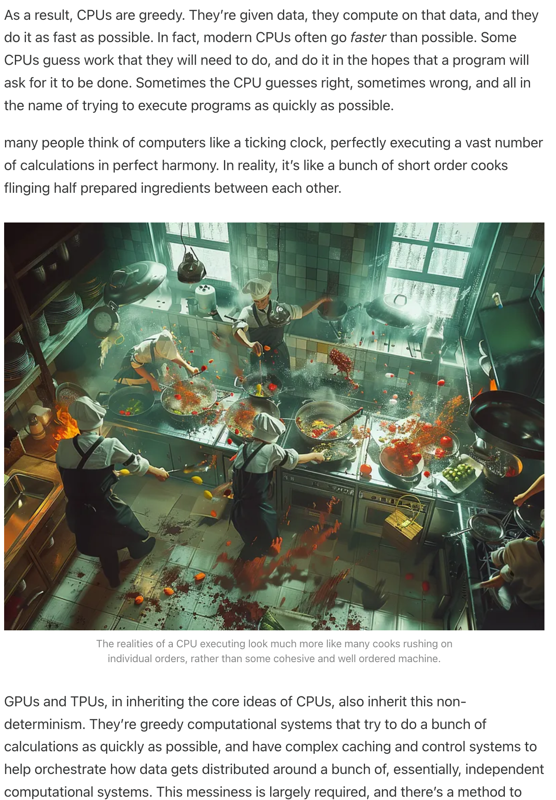

<b>Blog link:</b> https://iaee.substack.com/p/groq-intuitively-and-exhaustively-explained-01e3fcd727ab

---
- At a crux - AI basically is running a TON of simple calculations. To run this ton, we need good hardware! 
 
Most of the hardware (CPU, GPU, TPU etc;) we know are variants of "Von Neumann architecture" - Take in some input, have a control unit that performs some operations on this input, generate output in a meaningful way!
- We know a CPU has a control unit, an ALU (Arithmetic and logical unit) and a memory unit (registers) and buses!

 
The control unit as we see in this Z80 CPu (one of the first ones) basically converts the low-level instructions to a set of actions that the CPU can perform and keeps track of what actions it is performing etc;!

 
The ALU basically gets in a bunch of data and what kind of action to perform on it, does that action (add or multiply etc;) and returns the output

 
The memory unit basically consists of a bunch of registers to store the most frequently used elements (like a cache) so that the actions and everything can be done faster!! Think about revolution of FlashAttention!!

 
Buses are dedicated channels used to communicate and transfer their specific use-case related information!!

 
High level programming that we write converts (technically `compiled`) to a low-level stuff that CPU can understand which is basically instructions. All the CPU does is "Fetch, Decode and Execute" cycle i.e it fetches an instruction, it decodes what that instruction is into actionable items and executes those actions and this cycle repeats until the program is completed! All we need is for CPU to do this `quickly`

- `Core` is basically something that does the actual work! Multi-core is faster if the cores can communicate effectively among themselves! But usually, the design is such a way that each core does a different thing which is known as `process` (or technically a `program`). Usually, processes are atomic i.e they won't talk with one another!!
 
Each core is like a complex Z80. Each core usually has it's own instruction/task to perform. Closing search history tabs is a good idea because each tab basically uses a process which requires it's own set of resources. This is beneficial as if one tab hangs, others won't effect. But this also means opening 100s of tabs starts using 100s of process resources.

- Sometimes, a program can be broken down to pieces and can be performed parallely. To facilitate that, each core usually has several threads which shares some common aspects (like ALU) but each thread has it's own registers etc; which can speed up things as they perform in parallel

- So, in short a CPU has multiple cores and each core has multiple threads which has some capability of running things parallely! If we simply scale up the size of the CPU, we might be good!! Unfortunately that's not the case

- CPUs are like a heart of the computer and to have things in place and synchronize the processes across various places in the CPU, they have a quartz clock which runs very fast (1GHz) for eg which means it has 1 billion oscillations per second. Each oscillation basically does a fetch, decode and execute cycle!. They do things very fast i.e the speed of electricity through silicone is 60 million m/sec and a typical CPU has 3GHz which means the distance it can trave is roughly 20mm (< an inch). So, if we have an extremely huge CPU which has one instruction at one corner of the chip and the other follow-up instruction at the other corner of the chip, there will be a significant delay in communicating the instructions (forget about the actual computation, most of the time will be spent just in communication)!! - Again, remember FlashAttention. The core idea is to have neccesary memory as close as possible to the threads!

- Cooling issues, cost efficiencies (square chips on round wafers) are additional constraints in increasing size of CPUs

- CPUs don't work well for video games! The reason being video games needs lot of information to be rendered every single second (pixel level info). But the good news is, a lot of this info can be computed parallel (while CPUs are good at sequential tasks, not so great at parallel), so they give these instructions to a specialized hardware (which are the old-day GPUs; Graphical Processor Units)

- Old days GPUs are too focused on gaming related tasks and after 10yrs or so, the modern GPUs came which can be used for AI related usecases as well!

 
CPUs are good for low latency sequential tasks while GPUs are good for high-throughput parallel tasks i.e CPUs are designed to do things back to back very fast while GPUs are designed to do things a bit slow but in parallel!

 
CPUs work sequentially as they need outputs from previous step to compute the next task. So, they need to be very fast to do the computation! While GPUs on the other hand can do a lot of independent tasks parallely; so they can have some leeway to have overhead time for more latency (as they compensate this by more throughput)!! GPUs can do this by SIMD (Single Instruction Multiple Data) i.e take a lot of data, one particular instruction and do it! Because of this additional latency overhead, GPUs are not good for sequential related tasks!

- GPUs can have a lot more cores and threads as they are specialized/designed for a particular usecase, so their logic will be simpler compared to CPU. More technically, GPUs are designed for matrix multiplications and for that they do "fused multiply-add" (FMA) where they basically multiply a lot of different rows and columns parallely, add and continue multiplying them (things which don't depend on one another sort of)

- GPUs are good but are not super efficient in terms of tensor operations because they are not designed for that. So, what Google did is - they reduced the precision of GPU and built hardware that primarily does tensor operations - TPU

- TPU uses less precise numbers but precise enough for AI applications. That way, they can squeeze in many more computations. GPU works on vectors of numbers, TPUs work on vectors of vectors i.e they perform operations on vectors on vectors!! So, that way this is going back i.e CPUs are generalized, GPUs are specialized for video games, they slowly became generalized for AI use case which left some gap and TPU again went back being specialized for AI usecase

 
Again, CPUs can perform very fast but sequentially, GPUs perform very slow but parallely!! GPUs use cache to keep all the workers busy by backlogging a good amount of data to process as soon as the process frees up! That way, GPU can be good for high throughput

- Training AI models; no one cases about how fast we are doing the computation as long as the throughput is high (all cores are busy in running). Thus GPU/TPUs are good!  But for inference, we need to wait around the GPU to do all it's slow parallel stuff to generate the response which adds delay in huge scales

 
Groq is super focused on AI inference applications and is not built for general purpose stuff like CPU or accidentally use for AI like GPU or a modification of GPU like TPU! They built ground-up using TSP (Tensor Streaming Processor)

 
Each TSP core chip has 21 superlanes. 1 is reserved for failure mode so 20 work. From left, we have matrix multiplication, switch units (which rotates the matrices), big dark areas are memory units (~200MB of SRAM, removed cache hierarchy to get more memory fast registers), ALU at center which does bit general calculations, on top a control line and at the bottom an IO line which gets and sends needed data. 

 
As we can see here, data flows in Groq from the memory to all the components and once the computations are done they just get sent away. In CPU/GPUs, first an instruction has to be fetched, the data needs to brought from cache to the cores, the computations are to be performed and the data needs to be sent to cache and then the next instruction has to be fetched etc; Recollect `Fused Operators` in Pytorch which basically merges different operators i.e once the data is in core, do all the possible operations on it before sending it to cache! which will save transport time

 
CPU/GPU usually takes an instruction, fetches the relevant data from cache, makes computations and returns the data then takes the next instruction. It's like in a grocery store where we go item by item. But Groq has a set of instructions on what to do etc; beforehand for every functional unit including don't do anything which are precomputed beforehand and once it completes it's set of tasks, it just sends away the data. This needs things to know at ahead of compile time and it is possible via `Determinism` i.e knowing what will happen before it happens  

 
CPU/GPU/TPUs are theoretically deterministic but practically non-deterministic and act greedily with the best available information they have i.e as they need to compute things in a rush and a lot of uncertain things happen (closing a tab, hanging website etc;) they anticipate what will happen and run stuff (for GPUs it's bit different usecase) Groq on other hand knows for every clock tick where the data is present, where it will go etc as they predetermine the type of operations that needs to be done; `A lot of time and resources goes into keeping track of what's happening and communicating things (instructions/data) compared to actually computing the stuff`