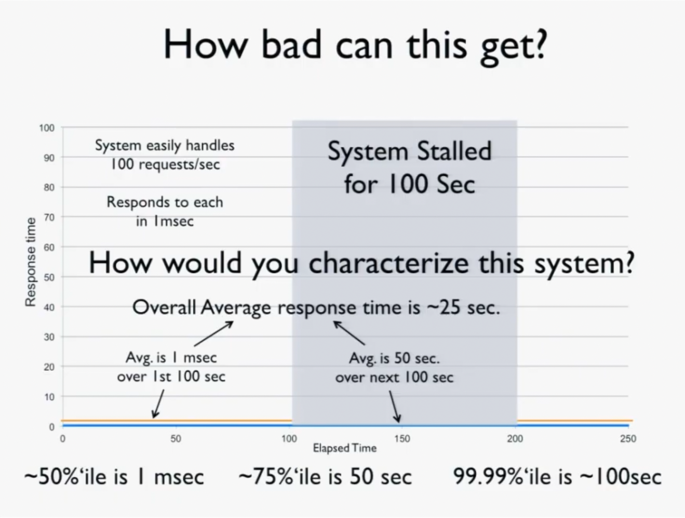
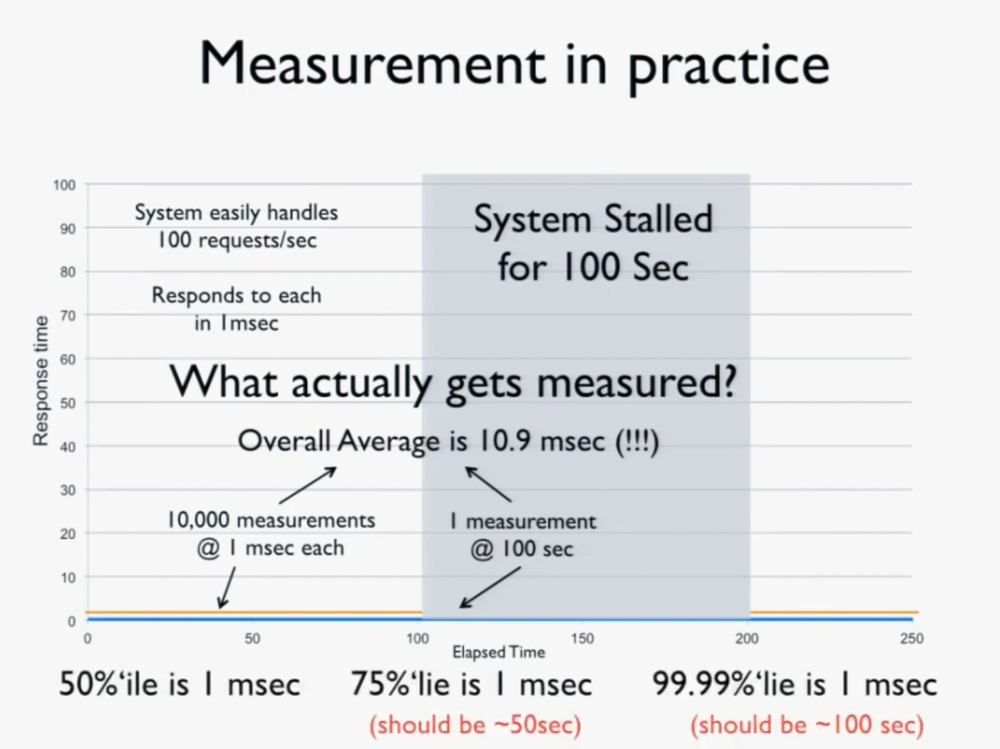
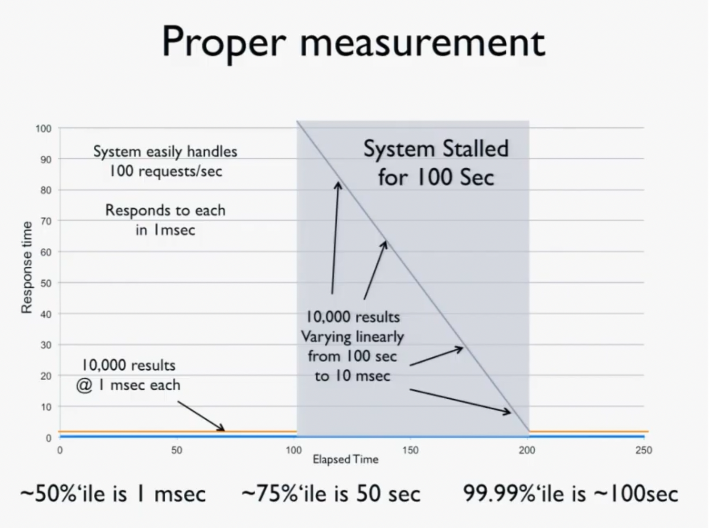
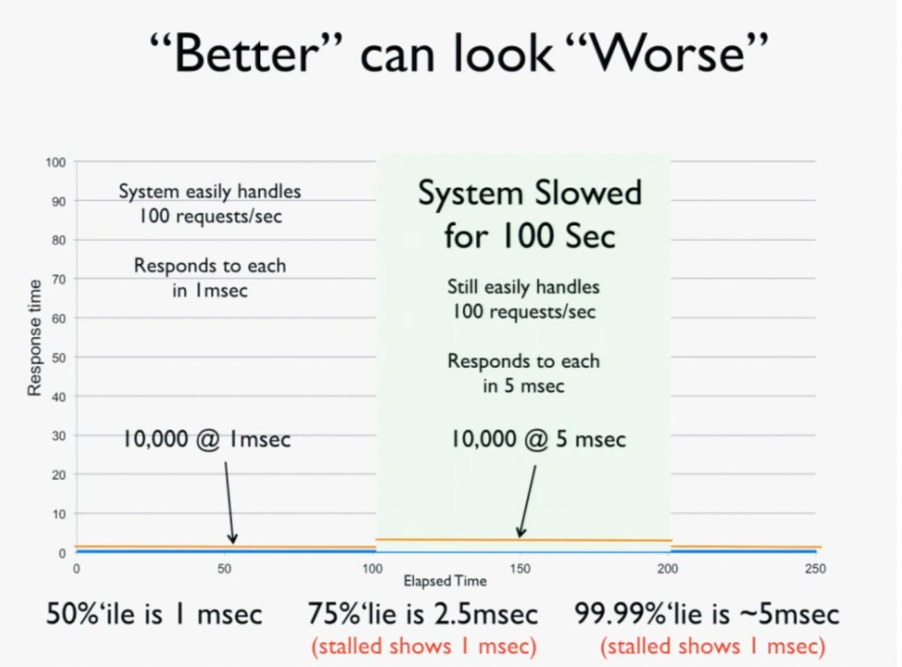
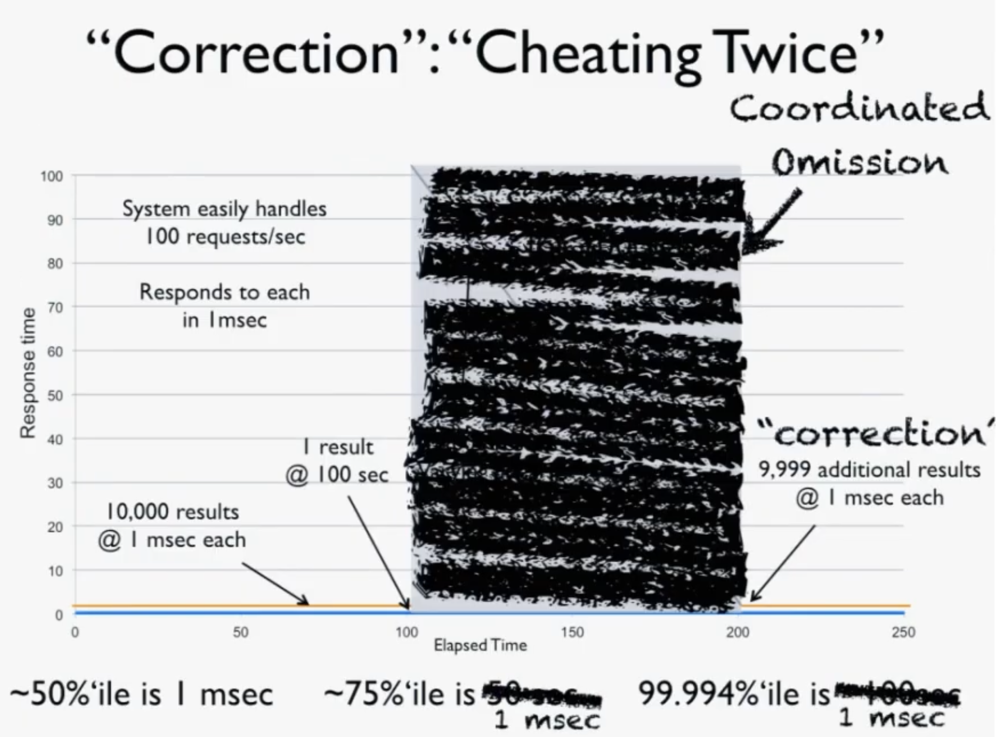
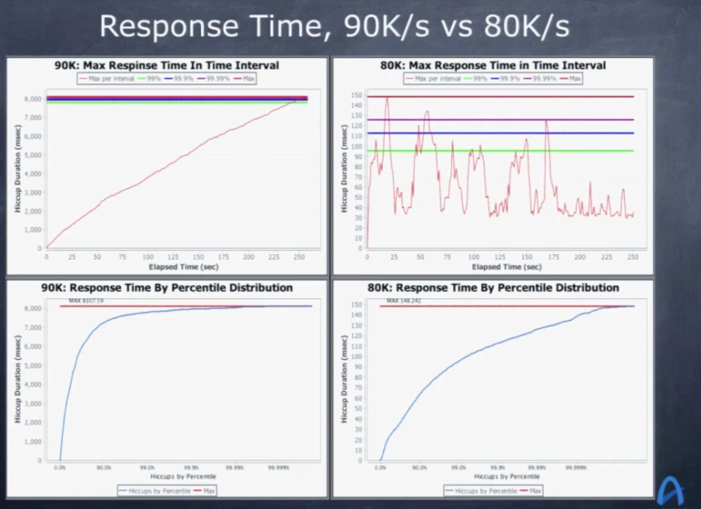
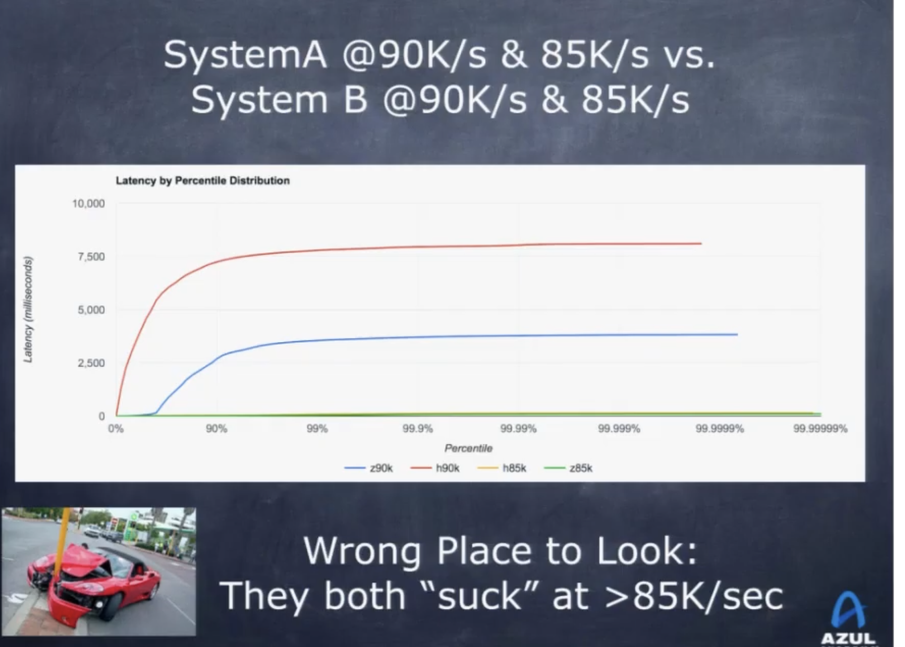

<b>Youtube: </b> https://youtu.be/lJ8ydIuPFeU?si=ZYoQE1B4VERd8mKL

---
- Latency is basically the time it takes for an operation to complete. In industry, people will care more about how latency (or the system) *behaves*! So, getting a single number for latency e.g the common latency was X i.e mean latency is X is not something people would be interested in for real world applications!
- Measure/show the maximum value when plotting the latency --  that will show the worst case behavior of our system!
- Don't average the percentiles. It's not meaningful! (read this for more details: http://latencytipoftheday.blogspot.com/2014/06/latencytipoftheday-you-cant-average.html)
- P99: Remove the top 1% worst latencies. The max of the remaining 99% of latencies will be the P99!!
  * What does P99 tells: What's the worst latency observed by 99% of the requests (by ignoring the top 1% latency)
  * Is this useful: Better than average (because that smoothes outliers); but if a user is using our system, what % does he/she falls under 99 percentile i.e if the user is experiencing in top 1 percentile of latency, that won't be captured! 
  * In web page loads, each click translate to `N` http requests, so the chance of experiencing the 99%ile will be `(1-(0.99)^N*100)` i.e for every page, the chance will reduce exponentially. So, as the system grows complicated, most pages experience the 99%ile latency! (read this: https://latencytipoftheday.blogspot.com/2014/06/latencytipoftheday-most-page-loads.html)
- Median latency is good for reporting but almost all the user experiences are worse than median latency!! i.e no one actually experience median!
- **Coordinated omission problem:** Latency measurement doesn't live in a vacuum i.e the common pattern is, client sends requests at a fixed rate but the server might take more time that that due to multiple reasons (it genuinely takes more time, there was a crash in between the requests which will not be measured if not accounted for etc;)
- Coordinated Omission occurs when the load generator we choose is unable to accurately create a workload representative of real world traffic while load testing a remote service (refer https://redhatperf.github.io/post/coordinated-omission/) 
    - **Total response time = wait time + service time**. A load generation tool that suffers from coordinated omission will only record service time and will fail to record wait time. Wait time can be significant and therefore can have a huge effect on summary statistics. (different materials will have different names for this, but the meaning is same; we need to record the "actual total time", not just the time taken by our code to finish it!)
    - `CTRL+Z` test to understand whether our load generator is effected by coordinated omission: When running the test, type `Ctrl + Z`..wait for sometime and continue that test. Ideally, that wait time should be recorded...if it's not recorded, it means we are only measuring the **service time** i.e how much time the system took to respond, and didn't include **wait time** which basically influences users experience!!
- Make load generator indepedendent of system under test (SUT) (i.e open loop load generator rather than a closed loop load generator). That way, responses will be queued (thus accounting for real world behavior wait times) as the SUT can't process and we are capturing that. 
Our load test should ideally characterize things like this
 If not done properly, we will be measuring something like this. There's "back pressure" from SUT on load generator (basically saying I can't process, dont send requests) and thus only 1 request got measured in the stalled 100 sec..that's the "coordinated" part in coordinated omission i.e SUT coordinated with load generator and it omitted accordingly (which is not ideal way of testing as it won't happen in real world)

A simple `CTRL+Z` test will tell if our load tester is suffering from this. If not, ideally, it should look like this i.e it should independently fire the requests to SUT and that will give true measurement. 

- You might think: "Ok, maybe I can use these numbers to improve my system's performance (not end user behavior) and see whether my optimizations are going better or worse (basically acknowledgint that we are looking only at service times!)", then also it carries some caveats. Because, if the load measurement is something like this, even though you did improve your system technically, "BM25 vs TFIDF", your load test tells that it is worse; basically it's hard to understand where to optimize i.e whether the slowness is coming from something from system or BM25 optimization for eg;. 

This is another bad pattern to do where you are firing the "remaning" requests "after" the downtime and not recording the downtime. So, "technically" you are measuring latency for 20000 requests, but as you missed capturing the downtime, you are not being realistic to the overall system.
- **Total response time vs service time** - As you are increasing the load, service time stays the same (as that's just measuring how much time it took to finish the service request) but total response time goes through the roof. So, if you are observing same latency for super high load, then maybe you are not measuring the total response time but service time (that's coordinated omission)!

Any load generator that's not showing the characteristics of "linear" response time (Y-axis, latency) as time passes by (X-axis) at extreme throughputs is lying i.e we are not measuring the response time but just the service time!! At low throughputs, latency will be ~0 so response time or service time both look same; so only with high throughputs we can be sure that by observing the linear fit, the system failed -- which is good as we now know the **critical/sustainable throughput**. Once we estimate this, then we can optimize the system and understand how this is changed on these loads!

- To understand how different optimizations are behaving, we shouldn't be looking latencies at or past **critical throughputs** as at that point, the system already broke; so it's no longer meaningful; latencies are irrelevant past this critical throughput point. We need to look at a throughput way before this threshold which will give true indication of how the optimizations performed! (in the above plot, it conveys the story that blue is better than red but when we look at 40K/sec; a realistic load where both systems are not broken, then it will show true picture that red is actually better than blue!!) 

**Other resources**: https://hdrhistogram.github.io/HdrHistogram/, https://igor.io/latency/