<b> Link: </b> https://newsletter.maartengrootendorst.com/p/a-visual-guide-to-mamba-and-state

---

- Computation of attention in training is fast as a lot of those pairwise attention score computations can be done parallel!! But during inference, it's not as fast as we have to wait for tokens to get generated.
-  During inference, we need to recompute the attention scores for all the possible pairs for every new step. This involves a lot of recomputation. To avoid that KV-Caching is enabled where we can store the previous computed attention scores so we don't have to recompute. But this involves memory tradeoff as a large KV Cache can't be stored in memory and we are easily memory-bounded!!
-  RNNs on the other hand needs only it's previous hidden state and current stage input to compute the current stage output thus saving lot of recomputation and memory issues. On the other hand, transformers need all the previous tokens/hidden states to compute the attention scores w.r.to current state token and this needs for every stage.
- While transformers has quadratic context length dependency during inference (at step N, we need to compute all the previous pair-wise tokens attention scores), RNNs on other hand has linear dependency with respect to sequence length.
 But the issue with RNNs is, because of the nature of hidden state, they tend to forget the information that's present at the start i.e they struggle a lot w.r.to long-context dependencies which transformers as good at as they compute attention scores for all the pairs (while being slower)!! So, trade-off of long-context dependencies accuracy (which RNNs lack compared with transformers) vs training and inference speed (where RNNs excel compared to native transformers).
- State Space contains the minimum number of variables needed to fully describe a system and is basically all the possible configurations that can be taken. And state space representation is basically a way to represent where we are currently located (current token info), our potential next position (next token) and some information on how far we are from exit (end token sort of!). The variables that describe a state is known as state vectors and in context of LLMs/Neural networks..these will be hidden state vectors!
 SSMs (State Space Models) is a model which at time `t` takes in an input sequence `x(t)`, maps it to a latent state representation `h(t)` and predicts an output sequence `y(t)` using those equations. The idea is by looking at the input and output data at every timestep, we can uncover the hidden dynamics between these two using these set of matrices `A, B, C and D`!
 The state equation tells how the current latent state (`h(t)`) can influence the next state (using `A`) and how the current input (`x(t)`) can influence the next state (using `B`).
 Output at time `t` will be determined by how the hidden state is influencing (using `C`) and how the input is influencing (using `D`).
 All A, B, C and D are learnable parameters! 
 Matrix D is usually the skip-connection as we have a direct mapping from input to output! Because of that, everything except the matrix D path is considered as an State Space Model (SSM)
 Remember that skip connection is not usually the part of the state space model, so this is usually a modified version of math we can see in papers. Also, our inputs and outputs are continuous, so it's continuous-time representation
- 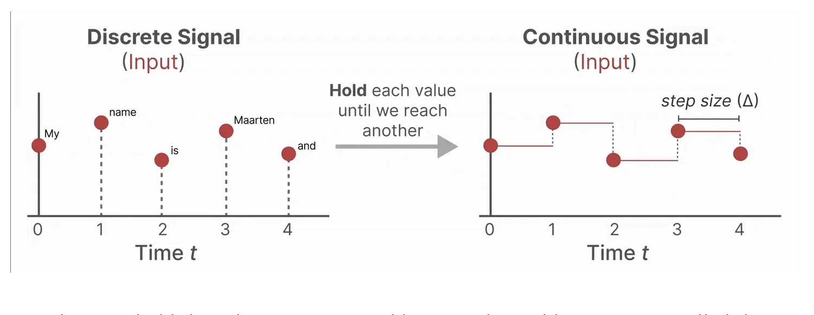 We have discrete inputs, so we need to convert it to a continuous signal for our SSM to work! This is done using _Zero-order hold_ technique i.e we hold the value till the next input is received! How long we hold is learned by step size $\Delta$ which is the resolution of the input.
- 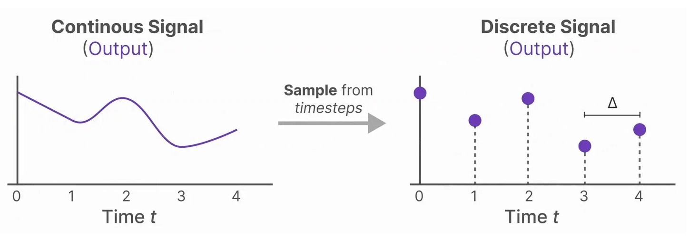 Now, passing this continuous input, we can get continuous output from which we can again discretize to actually get the discrete outputs which are our sample values.
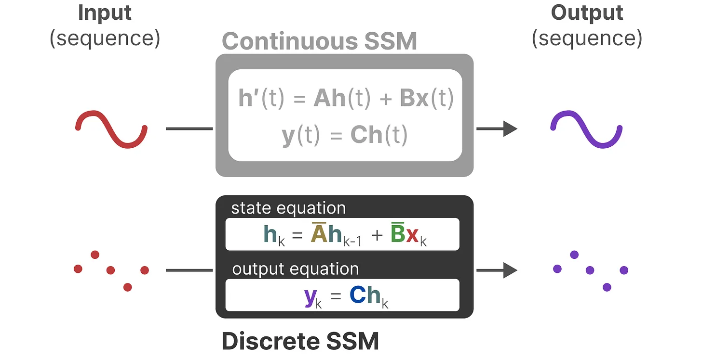 Difference between discrete and continuous version of SSMs! 
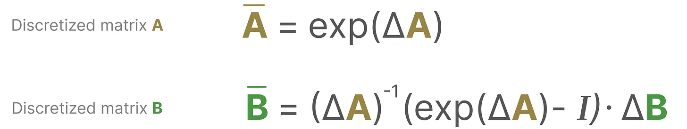 It's just that these matrices A and B are discrete versions and the input given to these machines and the outputs sampled are all discrete versions. But we still save the continuous form of `A` and not the discrete version of A during training i.e during training the continuous version is discretized to accommodate the math!!
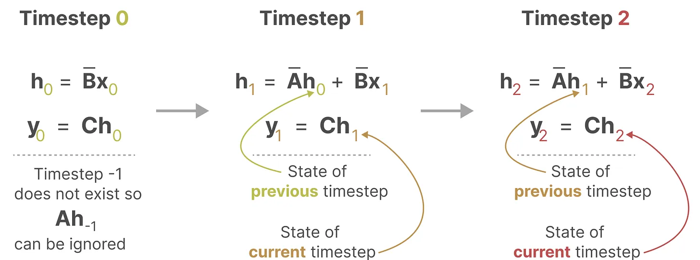 This discretized version is very similar to how an RNN works!
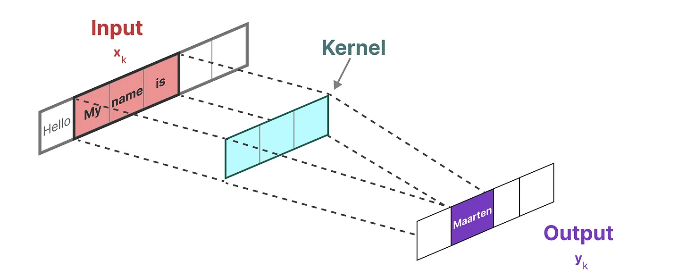 SSMs can be represented using the Convolutions as well i.e we need 1-D kernels that looks at text input and predict the tokens i.e these kernels can learn to predict the next token! 
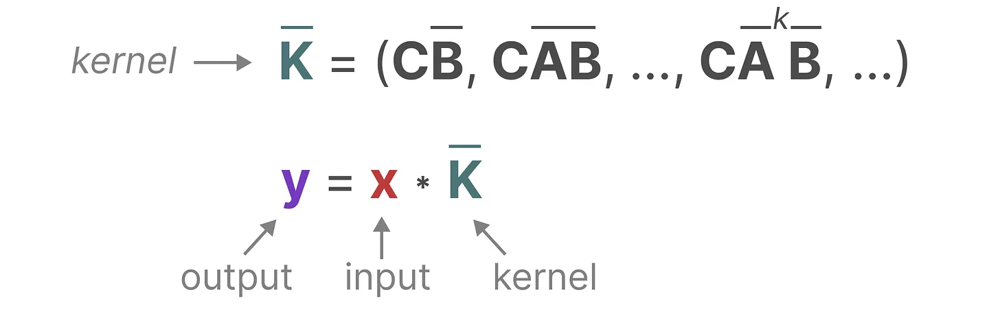 The kernel is determined by ABC matrices which are learnable and the output is defined by this kernel matrix.
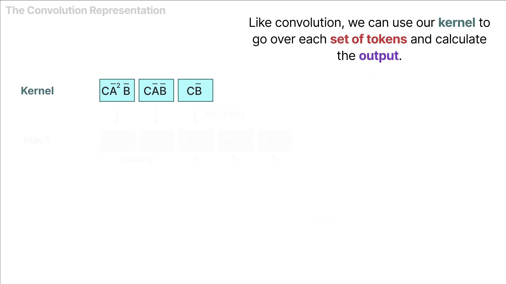
- Representing SSMs as Convolutions can fasten up the training as as it can parallalizable. But as the kernel size is fixed, the inference is not as fast and unbounded as RNNs.
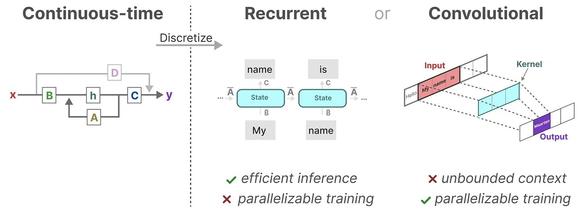 Representing an SSM either using convolutions or recurrent stuff has their own tradeoffs. So, researchers made a model using this tradeoff known as Linear State Space Layer (LSSL) which uses convolutional kernels during training and uses recurrent representation during inference.
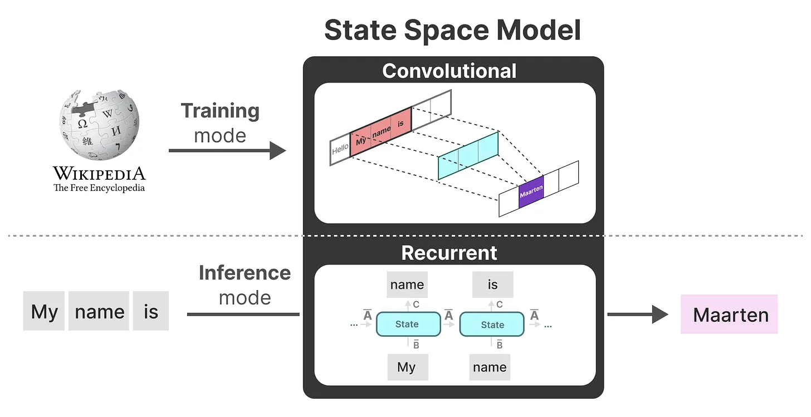 An important property is LTI i.e Linear Time Invariance which means that the SSM parameters such as `A, B, C` are fixed for all timesteps i.e these matrices are same for every token that the SSM generates i.e we have a static representation of these matrices that are not context-aware!. Now, that comes to be a limitation that Mamba tries to address.
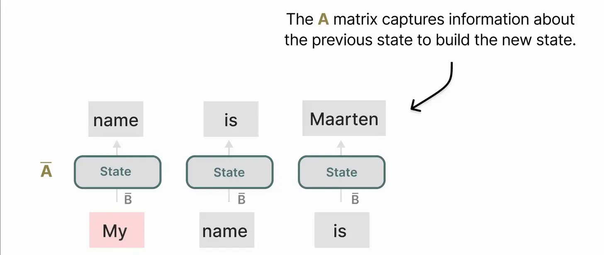 Now, matrix `A` is very important in design choice as it basically takes the previous hidden state and maps to current hidden state. So, a clever design of `A` can help in storage of lots of previous hidden states which is the major drawback of RNNs i.e losing long-context.
 The authors use HiPPO (High-order Polynomial Projection Operators) which basically compresses an input signal to a set of coefficients which can be used to reconstruct the output signal and the idea is to minimize the degradation in this reconstruction for older steps (for newer steps there will be less degradation as the model just saw it!) 
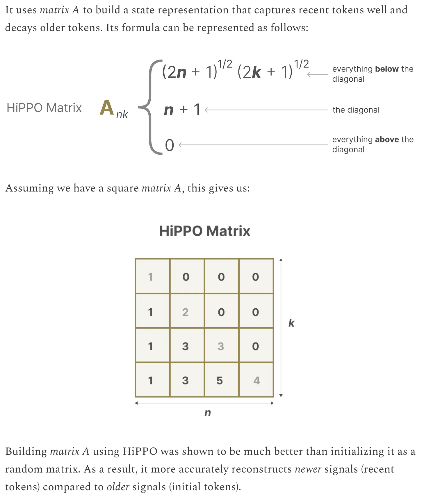 This is basically HiPPO initialization which is useful for long-context training and inference to not lose the long range dependencies as it tries to retain the information from the past history by tracking coefficients of Legendre polynomial which can be used to approximate the previous history!
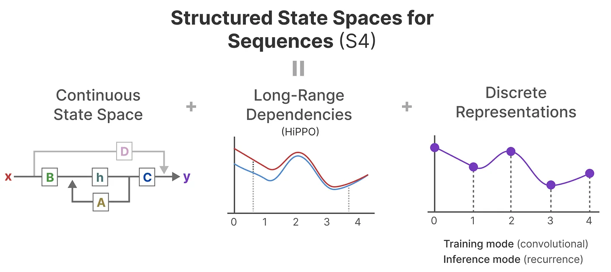 Applying HiPPO (to resolve long range dependencies) to SSMs (both recurrent and convolutional discretized versions) resulted in S4 i.e Structured State Space for Sequences (S4) a class of models that can handle long sequences efficiently! 
- Mamba is an extension of S4 - the 2 major differences i.e *selective scan algorithm* to efficiently select (ir)relevant context while predicting the next token and also a *hardware-aware algorithm* which stores and processes the intermediate representation more efficiently using `kernel fusion, recomputation and parallel scan` allows in creation of selective SSMs or S6 models which can be used like self-attention in Mamba blocks.
- SSMs and S4 fail in short to focus on relevant context or ignore irrelevant context that's needed to answer a given questions (the thing that attention-based transformers has been working on!!)