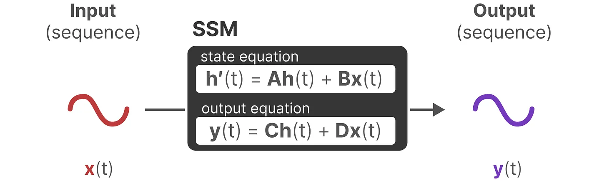

<b> Link: </b> https://newsletter.maartengrootendorst.com/p/a-visual-guide-to-mamba-and-state

---

- Computation of attention in training is fast as a lot of those pairwise attention score computations can be done parallel!! But during inference, it's not as fast as we have to wait for tokens to get generated.
-  During inference, we need to recompute the attention scores for all the possible pairs for every new step. This involves a lot of recomputation. To avoid that KV-Caching is enabled where we can store the previous computed attention scores so we don't have to recompute. But this involves memory tradeoff as a large KV Cache can't be stored in memory and we are easily memory-bounded!!
-  RNNs on the other hand needs only it's previous hidden state and current stage input to compute the current stage output thus saving lot of recomputation and memory issues. On the other hand, transformers need all the previous tokens/hidden states to compute the attention scores w.r.to current state token and this needs for every stage.
- While transformers has quadratic context length dependency during inference (at step N, we need to compute all the previous pair-wise tokens attention scores), RNNs on other hand has linear dependency with respect to sequence length.
 But the issue with RNNs is, because of the nature of hidden state, they tend to forget the information that's present at the start i.e they struggle a lot w.r.to long-context dependencies which transformers as good at as they compute attention scores for all the pairs (while being slower)!! So, trade-off of long-context dependencies accuracy (which RNNs lack compared with transformers) vs training and inference speed (where RNNs excel compared to native transformers).
- State Space contains the minimum number of variables needed to fully describe a system and is basically all the possible configurations that can be taken. And state space representation is basically a way to represent where we are currently located (current token info), our potential next position (next token) and some information on how far we are from exit (end token sort of!). The variables that describe a state is known as state vectors and in context of LLMs/Neural networks..these will be hidden state vectors!
 SSMs (State Space Models) is a model which at time `t` takes in an input sequence `x(t)`, maps it to a latent state representation `h(t)` and predicts an output sequence `y(t)` using those equations. The idea is by looking at the input and output data at every timestep, we can uncover the hidden dynamics between these two using these set of matrices `A, B, C and D`!
 The state equation tells how the current latent state (`h(t)`) can influence the next state (using `A`) and how the current input (`x(t)`) can influence the next state (using `B`).
 Output at time `t` will be determined by how the hidden state is influencing (using `C`) and how the input is influencing (using `D`).
 All A, B, C and D are learnable parameters! 
 Matrix D is usually the skip-connection as we have a direct mapping from input to output! Because of that, everything except the matrix D path is considered as an State Space Model (SSM)
 Remember that skip connection is not usually the part of the state space model, so this is usually a modified version of math we can see in papers. Also, our inputs and outputs are continuous, so it's continuous-time representation
- 