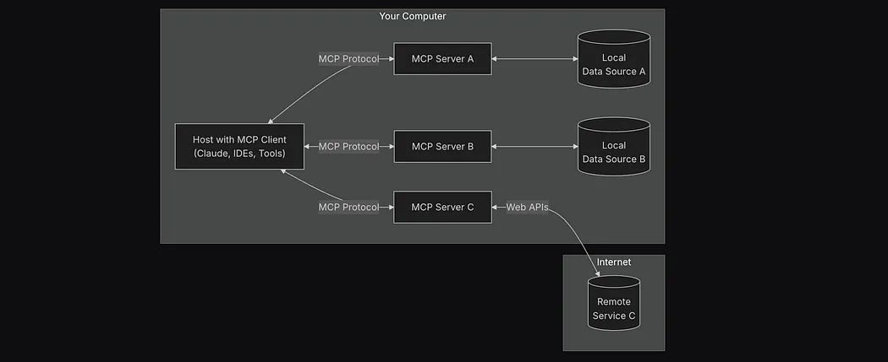
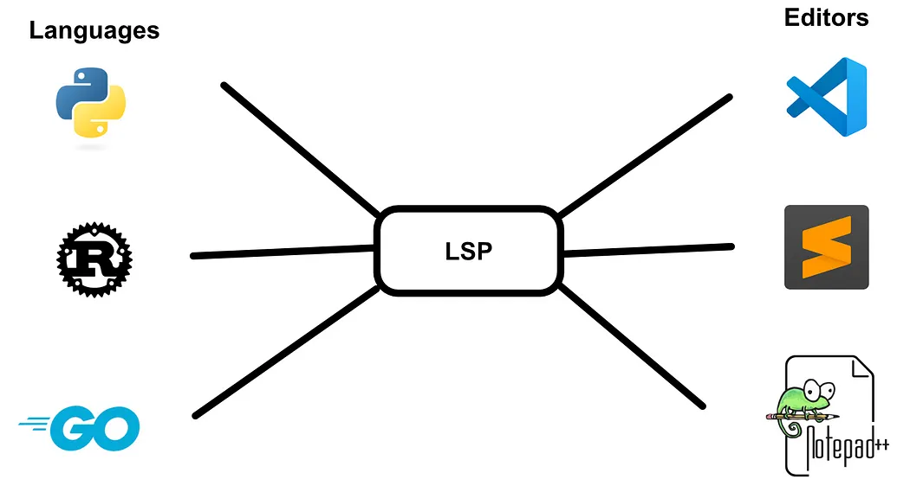
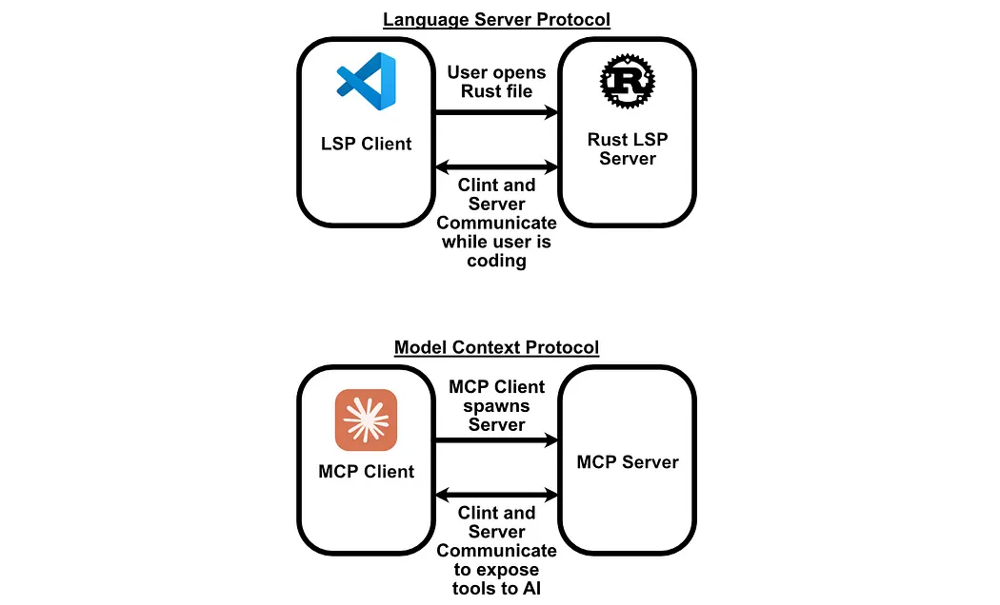
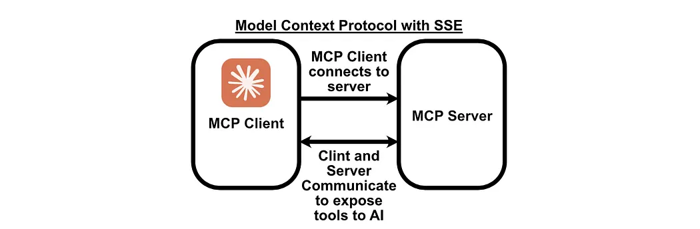
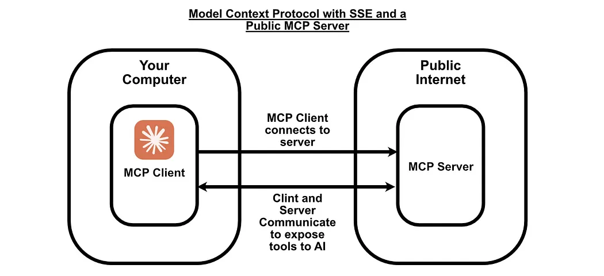

<b> Blog link: </b> https://iaee.substack.com/p/model-context-protocol-intuitively

---

- Connecting AI systems/agents with data in a standardized protocol mannered way! (AI applications <-> data tools). Basically how applications provide context to LLMs! USB-C port of AI applications.
- RAG and agents at a high-level overview.
```
RAG: 
1) Get question from user
2) Search for information about that question
3) Combine information with question into a single prompt
4) Send prompt to LLM
5) Respond to user with LLM response
6) Go back to step 1
```
```
Agent:
1) Get question from user
2) Get list of "tools" the agent can execute
3) Create a prompt that combines the question and a description of the
tools the agent can use. Tell the LLM to choose tools to execute.
4) Send that prompt to an LLM
5) Execute the tools the LLM chose, and collect the result
6) Construct another prompt that has the result of the tools. Tell the LLM
to respond to the user based on the result of the tools.
7) Send that prompt to an LLM
8) Respond to user with LLM response
9) Go back to step 1
```
- RAG will be deterministic in terms of retrieval while agent is stochastic (an LLM might or might not use a tool for the same question asked twice!)

- Claude desktop demo access screen, takes screenshots, passes that to LLM and generates action steps to be taken based on screenshoot. That is expensive and not viable always (from coder perspective)
- So, MCP on other hand creates a JSON (or Pydantic) format of the response needed for a given question so standardizing how data and models communicate
- LSP (Language Server Protocol): Connecting different coding languages (Python, R) to their tools (VS Code, Sublime) and underlying LLMs. MCP (how to connect data sources to the ecosystem of AI models) took inspiration from LSP (which is basically about how to connect programming languages to ecosystem of developer tools/IDEs)!!


Unlike traditional client-servers, MCP is a bit different. The client spawns the server!!

- The major pieces of MCP are: Resources, Tools, Prompts, Ping, Sampling and Roots
  - Tools: What all tools we created in server and exposed to client. (Tool implementation code usually will be there in `server.py` and client can access these tools in `client.py`)
  -  Resources: What all data resources the tools can accessed by client which basically spawns the server! This is currently application controlled i.e which resources to be selected can be either predetermined/selected by us or selected by LLM depending on program.
  - Prompts: Various prompts we use to communicate with tools, client, server and resources
  - Ping: Just to simply ping the server to make sure it's still there
  - Sampling: Allows servers to get response from LLM through client!
    ```
    The sampling flow follows these steps:
    1) Server sends a sampling/createMessage request to the client
    2) Client reviews the request and can modify it
    3) Client samples from an LLM
    4) Client reviews the completion
    5)Client returns the result to the server

    This human-in-the-loop design ensures users maintain control over what the LLM sees and generates
    ```
    - Roots: Boundaries where servers can operate!! Relevant resources and their locations
    - Transports: Actual communication between client and server!
      - Anthropic initially developed for their Claude Desktop so it's `stdio` i.e client and server lie in same machine.
      - As it gain popularity, client can be local system and servers can be remote thus changing this transport layer to HTTPs (i.e SSE - Server Side Events)
       
      Here instead of client spawing the server locally, we create a server and expose it via a port which the client can access the functionalities! Remember, server has the implementations of tools, prompts, resources etc; and client is a way to access them and pass to LLM to get response.
       These servers can be present over internet and that adds additional transport protocols but the concept remains the same
  - <b>Imp</b>: *LLMs to be implemented in clients. Resources, prompts, tools to be commonly implemented in servers and client should have access to it (if client spawns server). If it's over HTTP or if design is needed, client can implement some tools, prompts, resources and access the rest of the implementations from server!! Servers over HTTP are basically API tools we can access for streamlined data eg Google Maps API (which has it's own set of tools, resources and prompts) that we can access via a client.py* 

---
---
<b> Blog link: </b> https://huggingface.co/blog/Kseniase/mcp

---
- MCP in a nutshell: Orchestrations of multiple specialized models, different data sources present at different places and APIs/tools that can provide useful information!
- Limitation with tool usability - All the frameworks (including MCP) shows that models can still struggle with tool selection and usage (i.e models might not select particular tool when needed)
- Building blocks of autonomous agents
  - Profile/Knowledge - Observe and understand it's environment
  - Memory - Remember past interactions
  - Reasoning - Decide and plan it's next moves
  - Tool usage/outputs - Takes the actions
  - Self-reflection/Memory update - Reflect and learn
- MCP is not an orchestration engine or a brain! It provides a unified "toolbox" and defines how the tools are called and information is exchanged. 