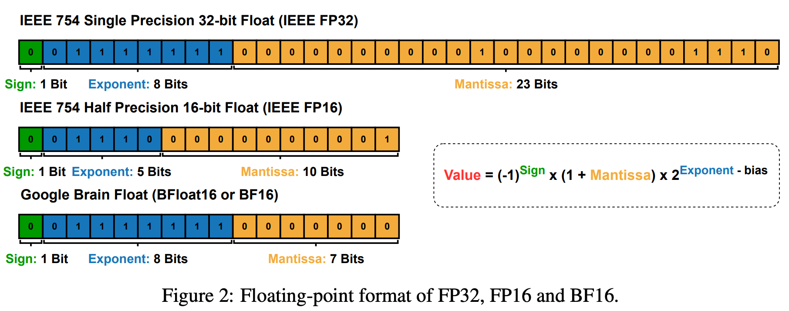

<b> Link: </b>  https://thinkingmachines.ai/blog/defeating-nondeterminism-in-llm-inference/

---
*tldr:* the primary reason nearly all LLM inference endpoints are nondeterministic is that the load (and thus batch-size) nondeterministically varies! for all GPUs, CPUs and TPUs this is valid.
- Reproducing same output in LLM systems even with temperature=0 is difficult/not feasible. Temperature = 0 means we will pick highest probable token always i.e greedy sampling where the sampling is theoretically deterministic and even then we won't get same output for same question when repeated multiple times.
- Inference using API endpoints is non-deterministic and inference using own hardware is *also* non-deterministic and several solutions has been proposed for production-level envs but the detailed rootcauses has not been studied in depth.
    -  An example solution offered by OpenAI (https://cookbook.openai.com/examples/reproducible_outputs_with_the_seed_parameter#implementing-consistent-outputs)
-  Production-level inference engines are aware of this issue and are working from past few years (https://docs.sglang.ai/references/faq.html#the-results-are-not-deterministic-even-with-a-temperature-of-0)
- . Another one by vLLM (https://docs.vllm.ai/en/v0.7.0/getting_started/faq.html)
- There are lots of hypothesis which were posited. 
    - **1. "Concurrent + Floating point hypothesis"** - Floating-point non-associativity and Concurrent execution: This basically says floating-point operations at finite levels of precision and rounding errors are not associative i.e (ab)c != a(bc) and thus the output depends on which concurrent core finished the operation first!
        - For deep dive, check this paper - Give Me FP32 or Give Me Death? Challenges and Solutions for Reproducible Reasoning., https://github.com/nanomaoli/llm_reproducibility?tab=readme-ov-file
        - While the hypothesis is true, it doesn't explain the full picture from the test code they provide.
        ```python
        A = torch.randn(2048, 2048, device='cuda', dtype=torch.bfloat16)
        B = torch.randn(2048, 2048, device='cuda', dtype=torch.bfloat16)
        ref = torch.mm(A, B)
        for _ in range(1000):
            assert (torch.mm(A, B) - ref).abs().max().item() == 0
        ```
    - **2. "Batching/Batch invariance"** Our output depends on other users requests which we don't have access/control to and "somehow", the information from other users is leaking and influencing our request prediction.
- Interesting to note that all these statements are true at the same time, so it's hard to understand where the non-determinism comes from!
    - Some kernels on GPUs are *nondeterministic*.
    - However, *all the kernels* used in a language model’s forward pass are *deterministic*.
    - Moreover, the *forward pass* of an LLM inference server (like vLLM) can also be claimed to be *deterministic*.
    - Nevertheless, from the perspective of anybody using the inference server, the *results are nondeterministic*.
- Why is there a numerical instability/difference - Limited precision + round-offs i.e *floating-point non-associativity*
    ```python
    (0.1 + 1e20) - 1e20
    >>> 0 # because adding an extremely large number makes the contribution from small number negligible, so (0.1 + 1e20) -> 1e20
    0.1 + (1e20 - 1e20)
    >>> 0.1 # this is straightforward!
    ```
    - But they are useful for `dynamic` precision levels. Roughly speaking, `value = mantissa * 2^exponent` is how a number is usually defined with some bits associated to mantissa and exponent.
     More formally different bit formats are presented using a preallocated number of bits.
    - The blogpost does 4 bit representation with 3 for mantissa and 1 for exponent. Because there are only 3 digits for mantissa, it has a limited range of representation!
    - Now, adding 2 floating point values with same exponents is fine but *adding 2 floating points of different exponents* needs some adjustment as we can't store all the digits, thus effectively *destroying information*.
    - So, because of *Limited representation of floating point values*, we can expect non-identical outputs but **why and when floating point values are added in different orders**
- "Concurrency + Floating-point hypothesis" - The above floating point non-associativity hypothesis and kernels completing the *atomic adds/fetch-and-add* concurrently in a non-deterministic order i.e we don't know which thread completes the execution first is this hypothesis. But these kernels (basically which does atomic adds) are uninvolved in inference nondeterminism!!
- *Fetch-and-add*: Fetch an element from memory and add it to final value. While every element's contribution is included in final sum, the order in which they might have come up is nondeterministic which makes these nondeterministic kernels. More specifically, this is "run-to-run nondeterminism" i.e running same code with same dependencies 2 times will give different results because of order of execution of SMs (streaming multiprocessors) underneath the GPU. But these are *not present in LLM forward pass*!!!
- **Why is atomic adds not required?** Atomic adds is basically providing parallalism across a dimension (i.e reducing) and it can be either done along the data dimension or batch dimension. For eg: If we have 500 vectors of 100 dimensions each (500x100) and we need sum of each of those 500 vectors (500x1), we can 
    - Either send each vector to one core - reducing via batch dimension i.e 500 cores are working at an instance --> *This leads to consistent results as the data among cores doesn't have any dependency.*
    - Each data point of a vector to one core - reducing via data dimension i.e 100 cores work to get the final sum for one data point. --> This leads to different results for different runs as the *order of core execution determines the output and data from one core is used by another core!!*.
    **Takeaway - Avoid communication between cores when possible!!**
Now, usually there's enough traffic to parallelize along "batch" dimension so libraries don't parallelize along reduction dimension! Even if they have to, they do sophisticated techniques to tradeoff determinism for speed i.e in previous eg; instead of sending 100 numbers to 100 cores and thus having non-determinism for 100 operations, they usually *split/tree reduce* it to five 20-element reductions and combine these 5 elements using *"clean-up" reduction* (which is not parallelized and thus is deterministic) or use *semaphore*!
-  From the perspective of the server, the *forward pass is run-to-run deterministic* as there are no operations that require atomic adds in forward pass!
- **Batch invariance and "determinism"** Matmuls are usually "run-to-run deterministic" but are not "batch invariant" *practically* speaking i.e when the batch size changes, each element in the batch can get different output!! -- But theoretically, neither the other elements in the batch nor how large the batch should affect the results of a particular batch!!
    ```python
    import torch
    torch.set_default_device('cuda') 
    B = 2048
    D = 4096
    a = torch.linspace(-1000, 1000, B*D).reshape(B, D)
    b = torch.linspace(-1000, 1000, D*D).reshape(D, D)
    # Doing a matrix vector multiplication by taking
    # the first element of the batch
    out1 = torch.mm(a[:1], b)
    # Doing a matrix matrix multiplication and then taking
    # the first element of the batch
    out2 = torch.mm(a, b)[:1]
    print((out1 - out2).abs().max()) # tensor(1669.2500, device='cuda:0')
    ```
    This (Matmuls) is batch-nondeterministic but is still "run-to-run deterministic" i.e running it multiple times gives the same result as the additions might not use atomic adds (maybe those are implemented as sequential reductions underneath for matmuls).
    While on the other hand, the naive *"atomic adds/fetch-and-adds" are run-to-run nondeterministic* i.e adding them multiple times will give different results depending on order.
    **Note:** Try reducing the dimensions, precisions (i.e current steps is 2048*4096) and you will see that there won't be any differences as that's floating point limitation!!
 Now, because we don't know other user request load etc; if these requests are batched together and if there's non-batch-invariant kernel involved in the system (which it is), then that will give rise to nondeterminism which will change the output of the individual request.
- Kernels involved in forward pass of an LLM
    - Pointwise operations: These are usually batch invariant. - Addition, subtraction, multiplication and division
    - RMSNorm (or any other norm)
    - Matrix multiplication
    - Attention
The rest of the 3 are not batch invariant kernels which involves reductions!
**RMSNorm**
 Assign each data point to a core so that the reduction happens inside the core without communicating with other cores. The key point in below code is `dim=-1` which reduces in the hidden dimension direction thus assigning one core per batch datapoint.
```python
    # x: [batch_size, hidden_dim]
    # weight: [hidden_dim]
    def rms_norm(x, weight):
        return x * torch.rsqrt(torch.mean(x ** 2, dim=-1, keepdim=True)) * weight
```
- Requirement for batch invariance - **reduction order for each element must be fixed regardless of the batch-size of the kernel** but the reduction scheme itself can be different!! So, when batch size affects reduction strategy (i.e choosing a different kernel), the reduction order will be different thus not making batch invariant so breaking determinism.
- Now, the idea of kernel choosing is basically to maximize the parallelism i.e to make sure the cores are busy. So, when the # kernelblocks launched (jobs) are > # cores, we are good (which is usually the case with large batch sizes) and when # kernelblocks launched are < #cores, the code might go to a *different kernel* to improve parallelism which means batch size affecting reduction strategy.
- For larger batch sizes - *instead of having each core handle one row you allow each core to handle different rows sequentially. This preserves batch invariance as the reduction strategy for each batch element remains identical.*
 For smaller batch sizes - Few cores are empty, so if the default way is left, the code chooses a different kernel as opposed with larger batch size one as a good kernel engineer provides path to atomic add (reduce in batch dimension) or split reduction which requires communication among cores, and making sure to have good parallelism! But this means the kernel is no longer *batch invariant*. So, an easy way is to ignore this and just let the normal *data-parallel kernel* run for small batches as well which is not great at occupancy but it's reasonable as it's small batch size, so the job will complete eventually anyway!!
- *Idea for future folks:* Use a reduction strategy *consistently* which has enough occupancy even in smaller batch sizes and thus has excess occupancy in large batch sizes!  
**Matrix Multiplication**
- Matmul - Pointwise operations (multiplications) along with reductions (additions) to reduce to 1 number per row x column operation.
 Output matrix is divided into 2D tiles (naive 1x1) and assign each tile to 1 core i.e the operations associated to that tile will be done in only 1 core avoiding communication with other cores. But additional constraints around arithmetic intensity and using tensorcores will make the 2D tile splitting a bit different (see color coding in image) rather than a simple 1x1 cell output tile/core.
- (M X K) and (K X N) -> Batch size is M and N, reduction size is K. 
- Matmuls also require to have much more “work” per core in order to leverage tensorcores effectively -> [1024, K] x [K, 1024] matmul and a standard 2D tile size of [128, 128], a data-parallel strategy would only be able to split this matmul into 64 cores (8 x 8), insufficient to saturate the GPU.
 While reducing along hidden dimension (known as Split-K Matmul) is GPU effective, it's not batch invariant. Matmul libraries are usually not batch-invariant but are atleast batch-position invariant i.e changing the position of the element within the batch doesn't affect the numerics.
 When batch size is small, a different tensorcore will be selected to complete the matmul and that might have a different reduction strategy!! thus making it batch variant!! 
- While a normal reduction (like RMSNorm) operate on one row at a time, matmuls also have tensorcore instructions as they operate on "entire tiles" at a time and each tensorcore instruction might have a different reduction strategy internally to make sure they are using GPU compute at max capacity. So, easiest way to *ensure batch invariance for matmuls is to compile one kernel configuration and use that for all shapes.* split-K is needed when both M and N are small but usually N (model-dim) is usually pretty large!! so we can avoid using split-K reduction. 
 Low TFLOPs at low batch sizes -> overly large instruction and insufficient parallelism. Jigsaw patterns -> quantization effects (tile and wave)  
**Attention**
 Attention has additional constraints
- 2 matmuls - reductions need to happen in *feature* dimension and *sequence* dimension while for RMSNorm and matmul, reduction happened only on *feature* dimension.
- So, invariance in attention means - invariant to how many requests are coming (batch) *and* how they are sliced up in the inference engine!!  
- In the "data parallel" strategy, parallelization can happen along the query tensor and reduction in K and V tensor.
- Now, depending on the choice of inference engine, a sequence can be processed in several parts (such as chunked prefill) or all at once (no splitup for prefill). So, the "batch invariance" here is that the *reduction order for a given token does not depend on how many other tokens from its sequence are being simultaneously processed.* Reducing KV values from KV cache separately from KV values of current token makes this not possible. We need -- when processing the 1000th query token in a sequence, the reduction order must be identical regardless of whether 0 tokens are in the KV cache (prefill) or 999 tokens are in the KV cache (decoding). 
 Now, just update KV cache and page table before the attention kernel itself, ensuring that our keys and values are always consistently laid out regardless of how many tokens are being processed.
- But there's still another problem with attention - This require a "split-reduction kernel" known as Split-KV or FlashDecoding. This is because if we don't parallalize along the reduction dimension (as that involves atomic adds which we don't want to deal with as those are not batch invariant), we can only parallelize only along the batch dimension, head dimension and "query length dimension" and in the decode stage, query length is small, so to have good compute use, our batch size should be very large! We can't ignore this as for eg: a very large KV cache makes attention to take a long time despite processing only one request (unless u parallelize in those dimensions) 
 For small batch sizes, we need to parallalize along the reduction dimension and one strategy is to use the "Fixed-length Split-KV Strategy", where the number of cores will be decided *first* and then the KV cache is splitted accordingly, but that makes it non batch-invariant! because the number of elements to be reduced by a core is changing (suppose we chose 4 cores, and when our KV length is 1000 -> each core will handle 250 elements and when our KV length is 2000 -> each core will handle 500 elements which can call a different reduction strategy!)
 Fix the size of each split, that way the number of splits will vary but because the size of each split is same, the reduction strategy will be same 

---
**Additional links**: 
- What shapes do Matmuls like - 
- Understand how matmuls work inside the GPU
- Atomic add
- Reduction: What it is, different types of reductions etc;
- FlashAttention
- KV cache
- Prefill and decode stage, chunked-prefills and decode-maximal batching


