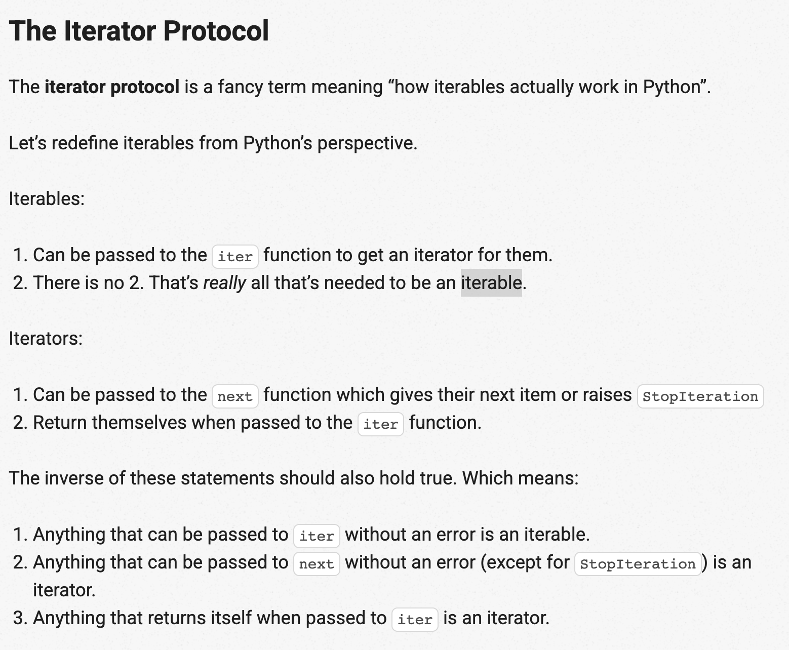

- We can't check length of generator nor index a generator i.e `a[50]` gives an error if a is a generator!! We can only loop through them that too only once i.e they get exhausted once they are used!!
- Generators are *lazy-iterables* i.e they won't get the work done unless we start looping over them. And they can be used partly i.e if you have looped till 3rd element, the rest of the elements are still preserved.
- `next()` is an easy way to go over the next element in a generator/iterable. for loop, converting to list comprehension are other ways.
- As they evaluate the values on the fly, these are memory efficient i.e as long as we don't need to know all the elements beforehand, better to use generators.
- `Map` function accepts a function (operation) and iterable and applies the function (operation) on each value of iterable. - It returns a lazy iterable whose values we can get only after we iterate over it. Map is kinda a transformation operation!
- `Filter` function takes in a function (operation), iterable and filters the items that satisfies that operation. This also returns a lazy iterable. However, this doesn't return the value from the function, it uses that value to determine whether to include that item/value in the resulting final lazy iterable!
- List comprehensions built new lists and do all the work upfront! Generators built new generator objects, delay their work until we loop through them as they do work element-by-element.
- Iterators are also *lazy single-use iterables*. Sequence as a list-like object and iterator is a generator-like object! - This behavior is known as *duck-typing*, we don't really care about the type of the variable, we just care about the behavior of the variable. https://www.pythonmorsels.com/duck-typing/
- File objects are also iterators i.e open('x.txt') gives a iterator that evaluates lazily i.e the *lines are retrieved from disk lazily*.
- Enumerate is also iterator (i, item in enumerate(a)). So does zip, reversed etc; `range()` is not an iterator!!
- `range()` is lazy, but range objects are not iterators! The confusion arises as both range and iterators are both lazily evaluated but has some differences. https://treyhunner.com/2018/02/python-range-is-not-an-iterator/
- https://treyhunner.com/2016/12/python-iterator-protocol-how-for-loops-work/ Iterable is something we are able to iterate over and iterator is the thing that does the actual iterating. Iterable is basically something that we can loop over with a `for` loop. They are not always indexable, they don't always have lengths and they are not always finite!
- Iterating using `while` works on lists or in general sequences (lists, strings, tuples), but fails on sets/dictionaries and other iterables which are not sequences! Sequences are one type of iterable that are indexable (thus can use a while loop) but other iterables like sets, dictionaries etc; are not indexable, thus looping via while loop.
- Iterables can be of infinite length in which case converting them to a list is not possible as a list should have predefined length beforehand. `count(step=5)` where count is from `itertools` is infinite. So, `list(count(step=5))` will throw a silent error i.e will just continue running!.
- All iterables (list, string, sets) can be send to `iter` to get an iterator! *Iterator just has one job - to return the next item in our iterable.* And iterators are iterables!! i.e calling `iter` on an iterable gives us an iterator. And calling `next` on an iterator gives us the next item or raises a `StopIteration` exception if there aren’t any more items. We can pass iterators to the built-in `iter` function to get themselves back. That means that iterators are also iterables.
 Using the iterator protocol is the only way to loop over ANY iterable in Python.
https://treyhunner.com/2018/06/how-to-make-an-iterator-in-python/
- Iterators help us to save memory (during initializations let's say) and sometimes time, and are used to construct objects for which we don't know the length beforehand let's say..as they load lazily.
- __init__, __next__ and __iter__ dunder methods are needed to be implemented in a class to be used as an iterator! But an easier/programmatic way to make iterators is by using generators
- If you are calling a method; eg: str(a), it's same as calling a.__str__() i.e the string dunder method, same way for others.
- Generator function uses `yield` instead of `return` and returns a generator object. Generator expression uses `()` instead of `[]` when creating the generator objects. So, if a normal function has `yield`, calling that function won't return the values. It will return a generator where we need to use `next()` to get the actual values from that function.
- 