<b> Link: </b> https://blog.ezyang.com/2019/05/pytorch-internals/

Read the blog again as it has more images and better explanation

---

- "Extension points" are basically like metadata for a tensor. Like dtype, device etc;
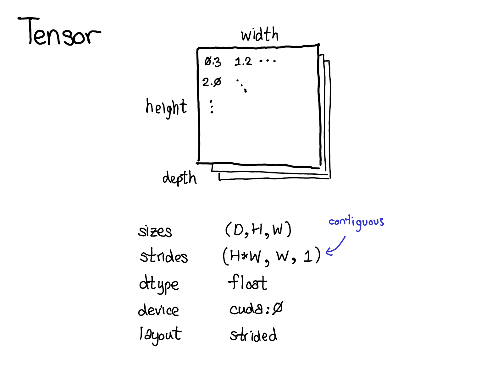
- Tensor is a logical representation. Stride is the actual memory layout representation (contiguous)
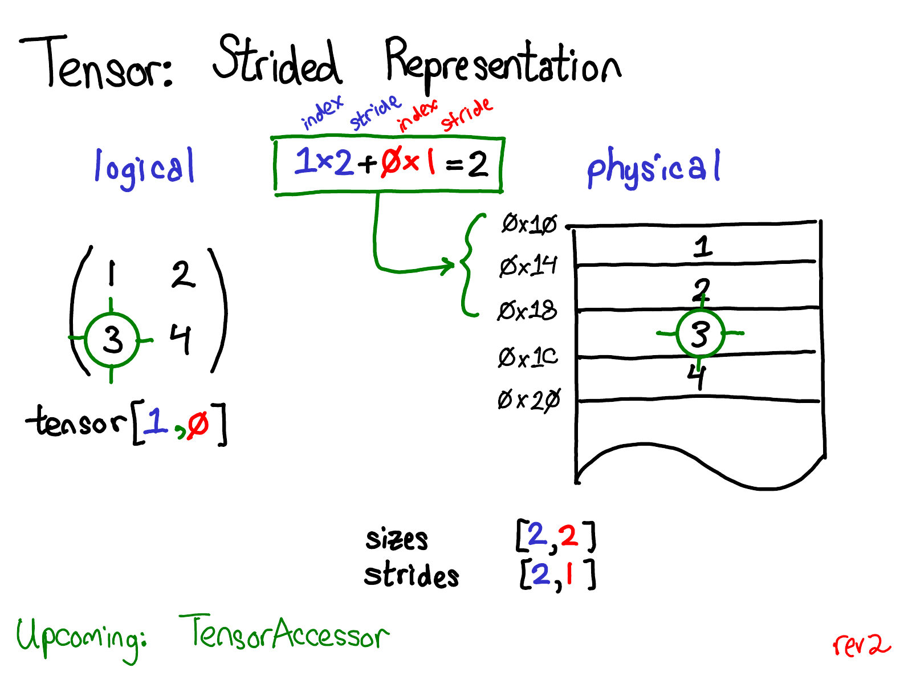32 bits means 4 bytes. Our matrix will be physically mapped and we want to access something let's say A(1,1) element, the strided fashion will be (1) * 2 + (1) * 1 = 3; when we use 0-index. In short, multiply each index with respective stride dimension and sum it up. This is what we call by row-major contiguous memory layout.
- A[1, :] and A[:, 0] are different views of memory. This is achieved by setting respective strides and offsets. Offsets are used to get a slice of a tensor (it won't create a copy of the tensor!!)
- For eg; a stride of 2 and an offset of 0 means, we take elements 0, 2, 4, 6 etc; A stride of 1 and an offset of 2 means we take elements 2, 3, 4, ... 
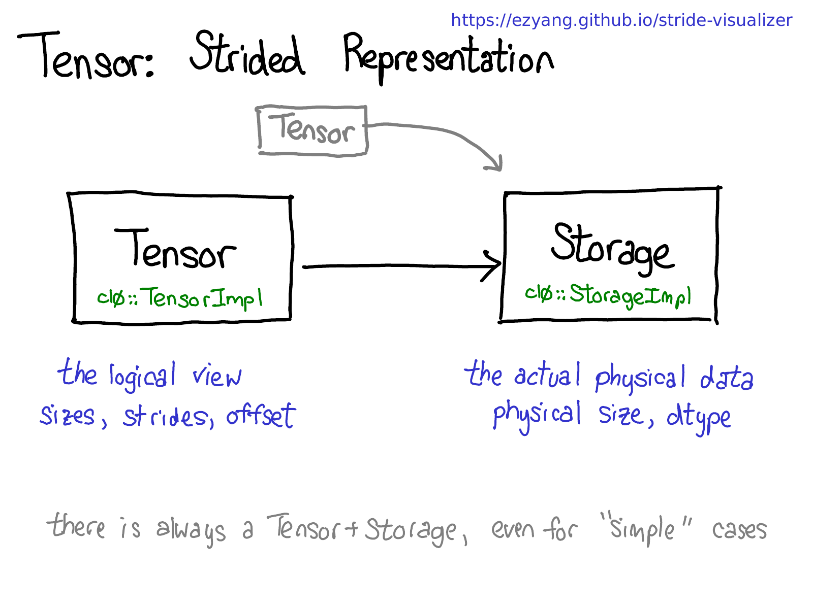 Storage will have the physical layout and tensor will have the strides, logical view and other metadata.
- There always exists a "Tensor-Storage" when we create a tensor irrespective of whether we store or not i.e torch.zeros(2,2) does have contiguous memory.
-  **There can be multiple tensors that can share the same storage. It's possible by the metadata of tensor such as stride, offset etc; as it's just the logical representation of the tensor**
- There are 2 dispatches in torch.mm - One is for device type and the other one is for dtype. The dispatch for device type is a Dynamic Dispatch as different implementations are in different libraries.
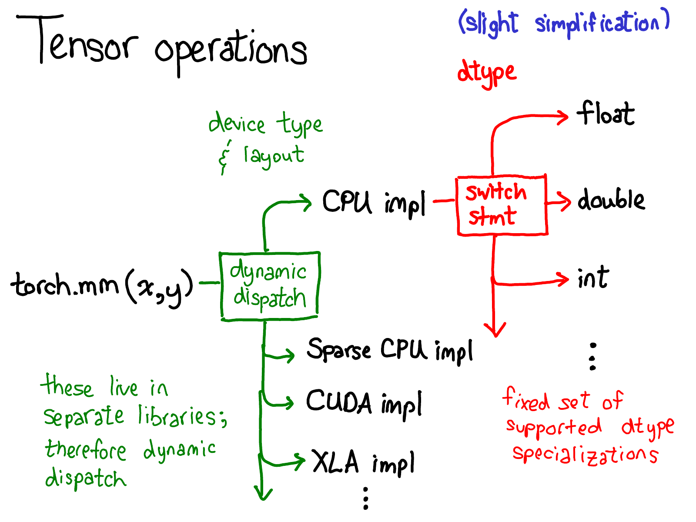
- https://llego.dev/posts/power-dynamic-method-dispatch-python/
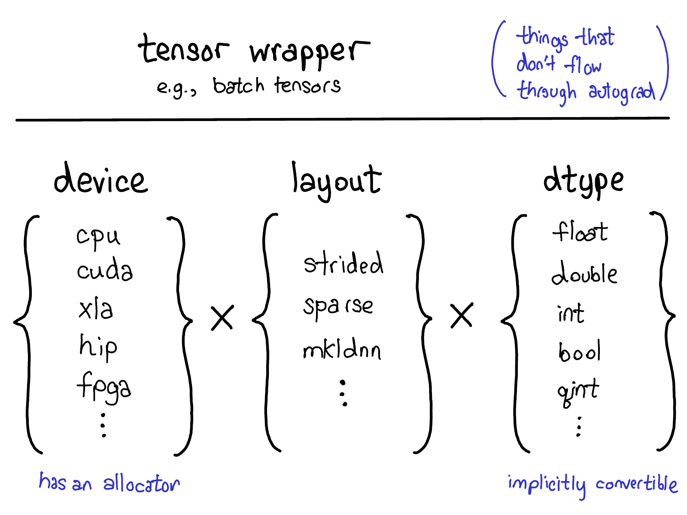 There are lot of combinations to consider - the device, the type of data (layout) and how it is represented (dtype)! These 3 are very important to understand what data we are dealing with
- Logical representation of tensors - Dense data is usually represented by strided tensors, sparse tensor is by a pair of tensors one for location and other for tensor and MKL-DNN tensors using block representation
- Tensor abstraction + Automatic Differentiation is what Pytorch largely does!
- 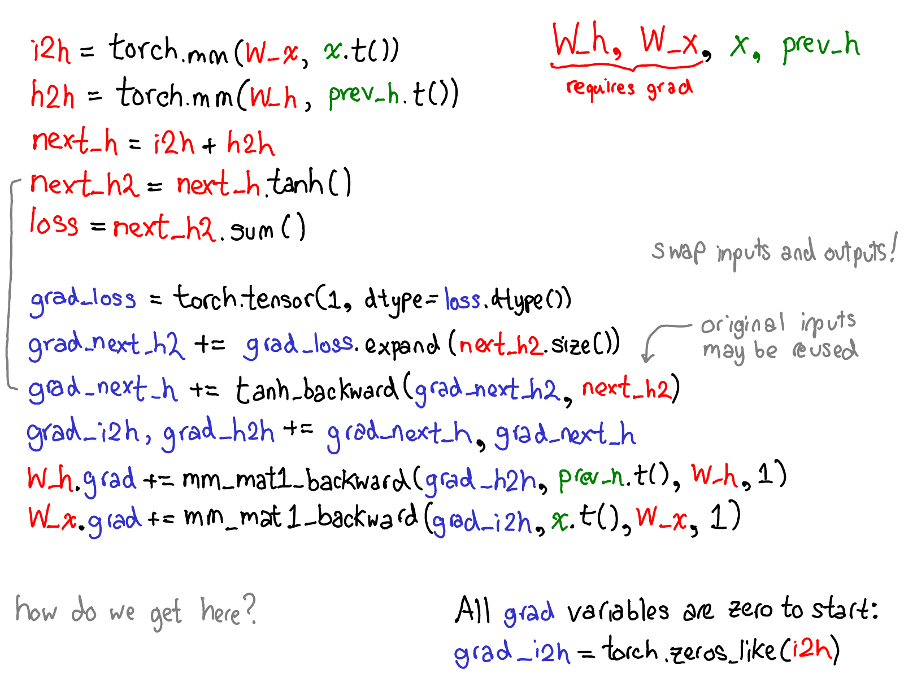 Reverse mode automatic differentiation basically has the forward pass information and computes the backward pass one step at a time of the forward pass in a reverse (stack) way! So, loss will be taken to compute grad_loss etc;
- 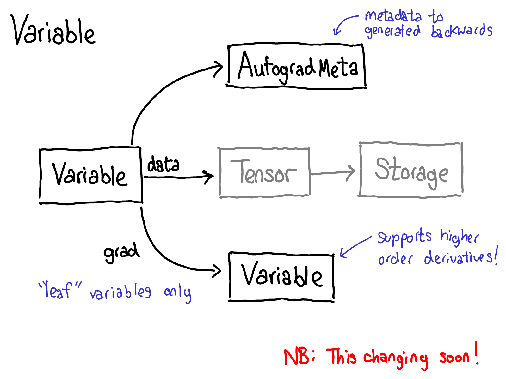 A variable has it's tensor values which will tell how to store (layout), the type of data and it also has AutogradMeta which has the metadata to generate backward computation!
- 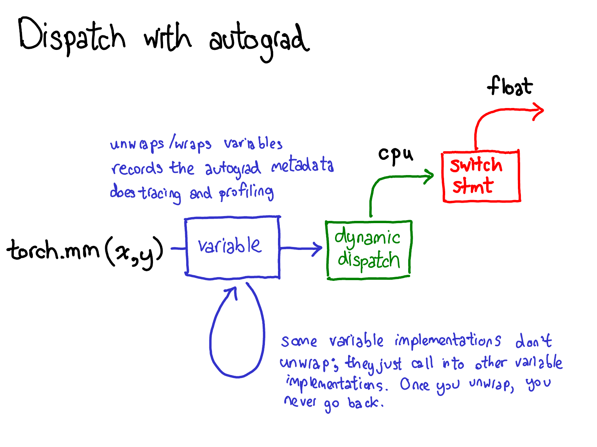 A dispatch with Autograd looks like this. Every variable has some metadata which tells how to store the data (stride, sparse etc;), where to store the data (CPU, CUDA etc;), type of data (float, int) and metadata relevant to compute automatic differentiation. A variable may call another variable and so on, but once a variable has been unwrapped totally, we won't go back to Variable Universe and enter the Tensor Universe! Pytorch has Variable-Tensor merge which I didn't grasp entirely but the idea is to reduce dispatches.
- 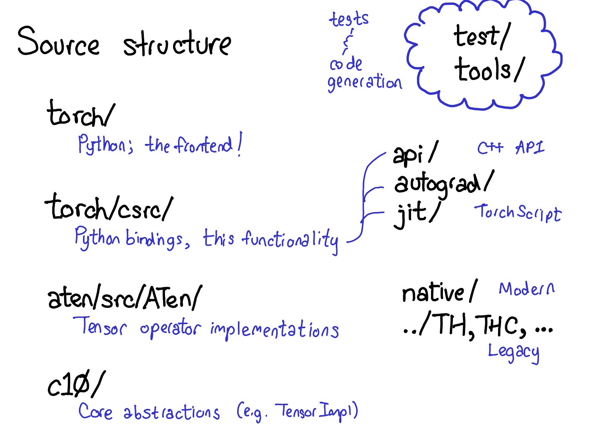 Pytorch has mainly 4 folders. aten (A tensor Library) has the operations on Tensors. Kernel code mostly lives here. c10 is core abstractions for Pytorch which has the actual implementations of the tensor and storage data structures. torch/ is the frontend Python code and torch/csrc/ is the C++ code which communicates between the Torch and low-level implementations (this has the autograd engine and JIT compiler).
- 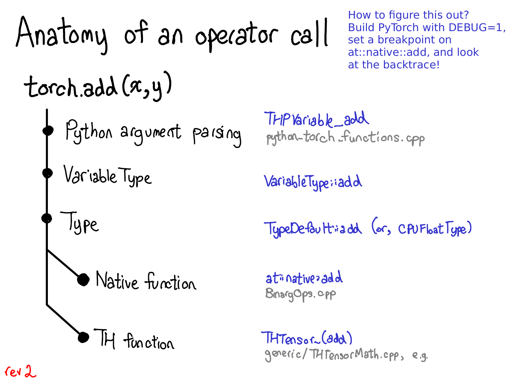 Every operator call has a Python to C++ translation, variable dispatch (VariableTyep), device type/layout dispatch and actual kernel (which is either the native kernel or the legacy TH function)
- 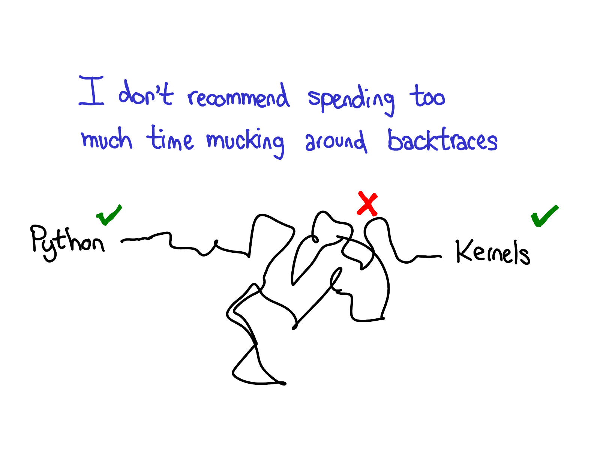 From Python, All of the code, until we got to the kernel, is automatically generated.
-  Every kernel has some metadata which helps to get the Python bindings. And there will be error checking (which is mandatory), allocating enough memory layout for final output, doing appropriate kernel dispatch based on data and the operation logic (need to write parallalized/vectorized version) for efficiency depending on which kernel it is.
- 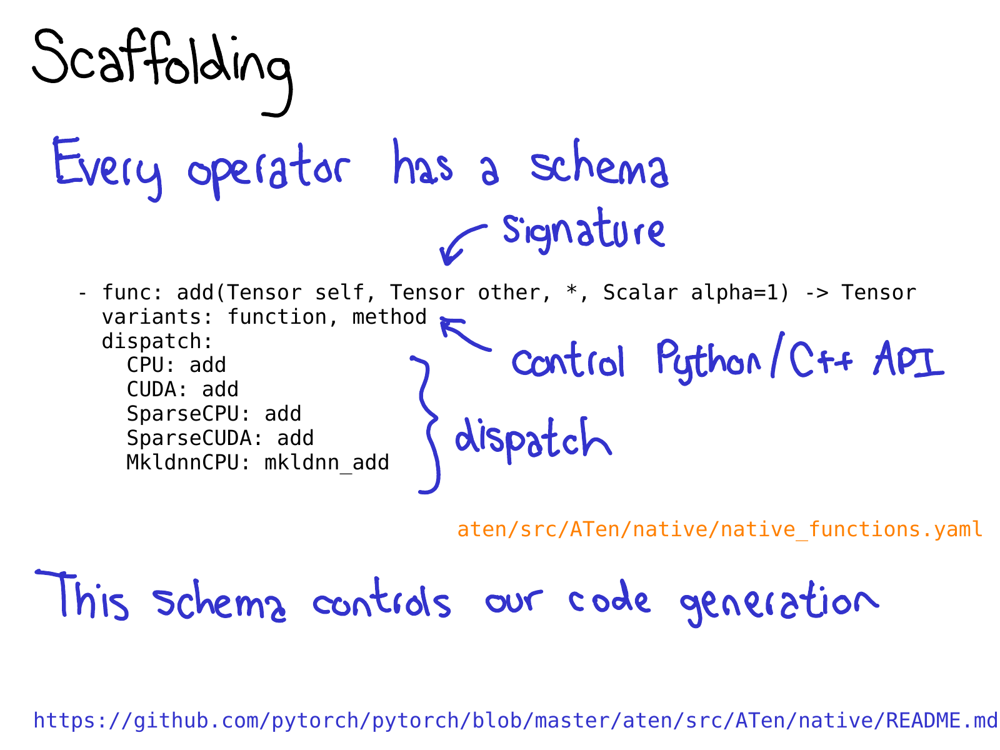 Pytorch kernels needs to be added in native_functions.yaml and their respective derivative operators in derivatives.yaml so that backward pass is possible! This schema helps to understand which kernels to call depending on type of data.