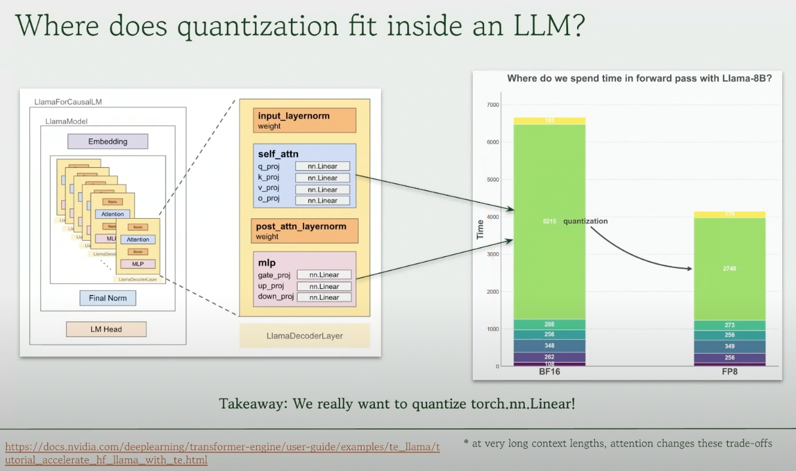
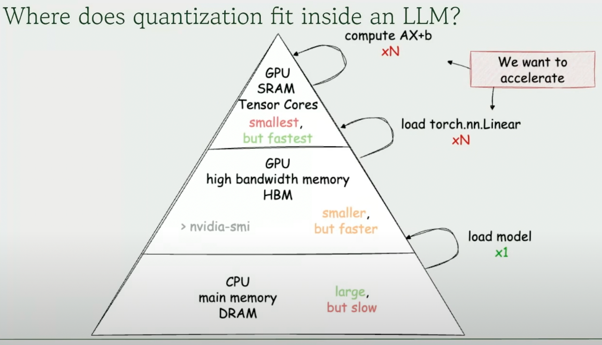
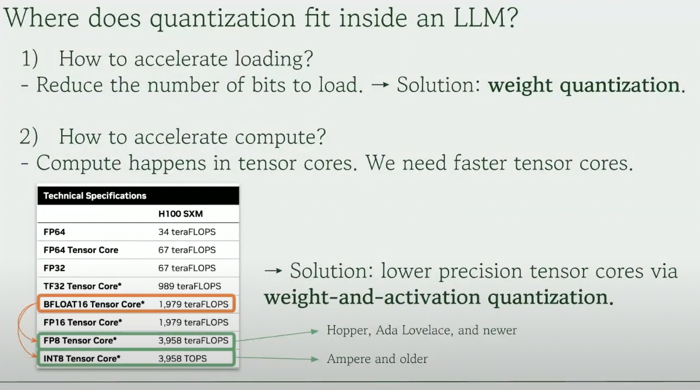
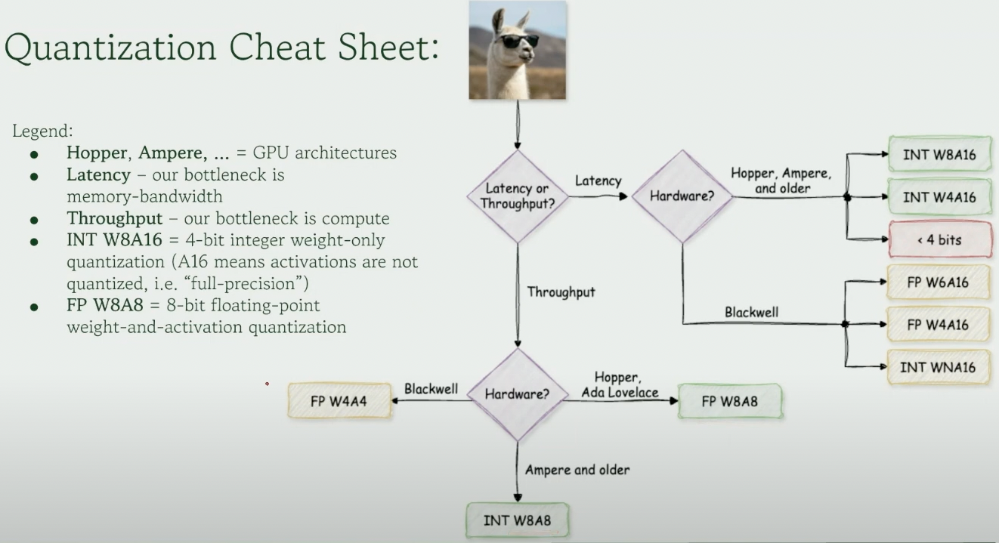
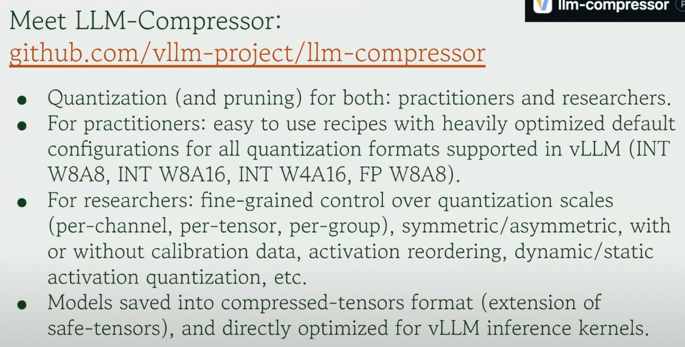
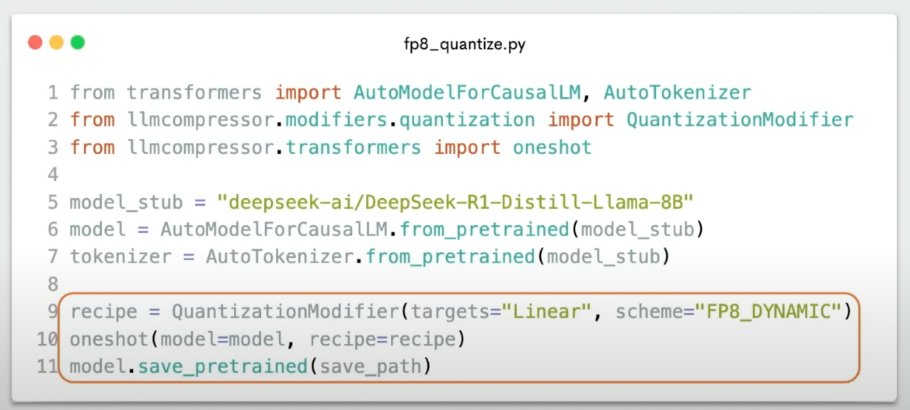
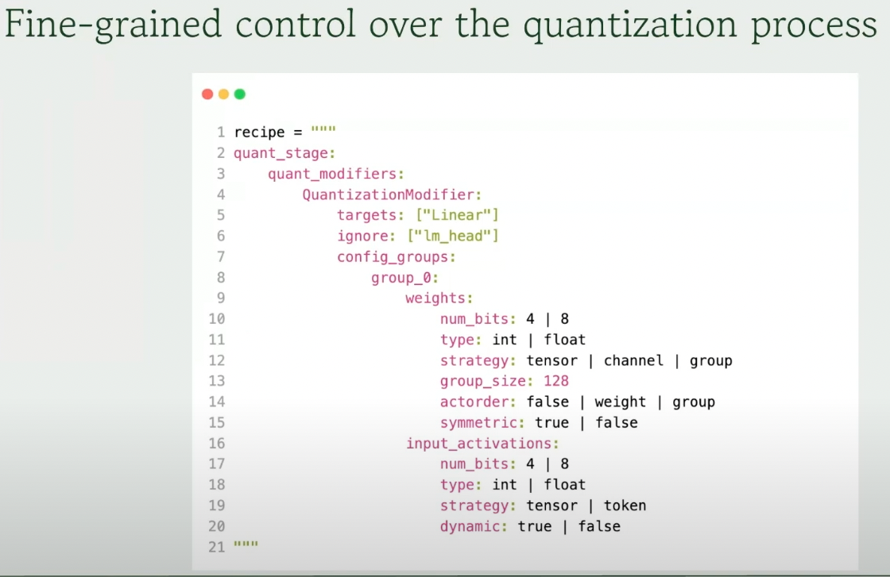
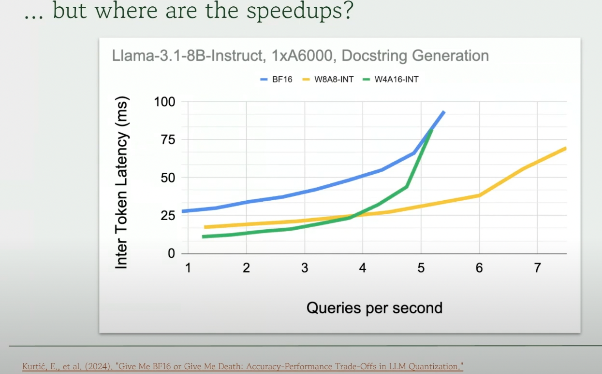

**Video link:** https://youtu.be/LK2-lrLvhTA

---

### Key Notes
- Quantization: Mapping high granularity to low granularity which reduces the precision of the weights! Because we end up mapping multiple original weight values to same low precision value (many in same buckets), that'll result in quantization error which will impact the performance of the model.
- Learn about data types, **TODO:** FP32, FP16, BF16, FP8, INT8, Exponent and Mantissa (E5M3) etc;
- Improves inference efficiency by
    * Faster loading of weights (less weights to move around)
    * faster matmul operations (as we are dealing with lower precision)
- Deployment of quantized models via vLLM increased from 20 to 40% from 2024-25!
-  Most of the time in forward pass is spent in torch.nn.Linear operations!
-  Model loading from CPU to GPU is only once. But loading the Linear layers from GPU to SRAM and actually doing the multiplications occurs for the entire forward pass time - so we want to optimize those
- Accelerate loading of nn.Linear: There's nothing much we can do as the GPUs come up with specific transfer speeds between HBM and SRAMs. So, the only way to do is to **reduce the number of bits to load** i.e weight-only quantization.
- Accelerate compute (matmuls): This happens in Tensorcores. So, use faster tensorcores. 
-  For that to happen, we need to quantize both weights and activations to lower precision so we force them to use faster tensorcores i.e if weights and activations are in FP8, then the hardware ends up using FP8 tensor core (if available) which is 3900TFLOPs i.e 2x faster than using FP16 tensor cores. *Both weights and activations has to be quantized for this.*
-  Now, the right side (Latency side) can be viewed like a chatbot etc; where users won't wait for 10min for the output to come. The bottom side (throughput side) can be an application where multiple queries are present etc; and we want them to run as fast as possible.
-  vLLM = Redhat + NeuralMagic!
- For latency-sensitive application (chatbots) - those are memory bound as the time taken to move the weights and data from HBM to SRAM will be much higher *compared* to the time spent in matmul computations in tensorcores. So, we will be benefitted if we fast this data/weight transfer from HBM to SRAM which can be done by *weight-only quantization*. We don't need to quantize activations here as the time spent on matmuls is << compared to time spend in data transfer, so using FP8 vs BF16 tensorcores won't matter that much!!
- On the other hand, for throughput-sensitive applications (summarizing 100 documents), we want it to be as fast as possible and there's substantial time spent on matmuls, so we want to use the faster cores. So, doing *weight-and-activation quantization* will not only speed up data/weight loading and transfer but also helps to use faster tensorcores such as FP8/INT8 tensorcores rather than the default BF16 thus being 2x faster! The exact quantization to pick depends on hardware support and availability of those tensorcores for that hardware!!
-  Linear layers are quantized to FP8. Weights don't change, so their quantization scales won't change so everything can be precomputed i.e static quantization. On the other hand, activations depend on input so the activation ranges changes. We can either have a small calibration dataset, precompute the ranges for activations before hand and quantize them to that range and deploy (static activation quantization, very fast but not super accurate) or we don't need any calibration data and compute the ranges of activation on the fly during inference know as dynamic activation quantization (which is more accurate, doesn't need calibration data, but a bit slow 5-10% compared to static activation quantization).
- SmoothQuant -> Useful for weight-and-activation quantization where some of the hardness to quantize activations is shifted to quantizing weights.
-  More knobs to play with for researchers!
-  If you try to do weight-and-activation quantization for latency-sensitive applications (which are memory bottleneck), you won't gain any inference speedup compared to weight-only quantization (as the proportion of time spent on matmuls using FP8 or FP16 is << compared to weight/data transfer btw HBM and SRAM) but you will lose accuracy as activations are now quantized unnecessarily! The left part of intersection of yellow and green (queries <4) is basically memory bound i.e most of the time is for transferring weights from HBM to SRAM - so it's good if we do weight only quantization there. The right part where queries per second i.e batch size > 4 is compute bound i.e we spend more time doing matmuls, so we will be better off if we use faster tensorcores, thus weight-and-activation quantization is better.
- PTQ: Post-training quantization is simpler to do and fits in one GPU. QAT: Quantization-Aware training is hard to do as we need to simulate the entire training pipeline (this has fake quantizers).
- W4A16 INT: Load the weights in 4bits from HBM to SRAM, unquantize weights to 16bits, do computation in 16bits using FP16 tensor cores. As we are in memory-bound, computation is free, so doing this extra step won't hurt latency. We can't do 4bitx16bit matmul as of now (except for Blackwells), so weight only quantization has this quantization and unquantization stuff going under-the-hood.
- The hardest ones to quantize is the smallest model to weight only quantization (for eg: 8B model to W4A16 INT) as accuracy drop is pronounced.
- We can also compare larger quantized model vs smaller unquantized model as the model sizes are comparable. And usually larger quantized model >> smaller unquantized model (from deepseek as well similar findings!!)
